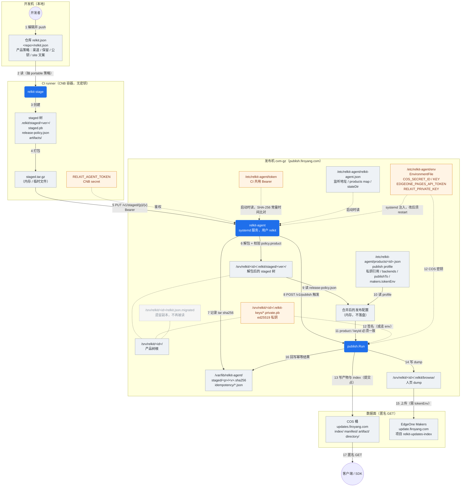
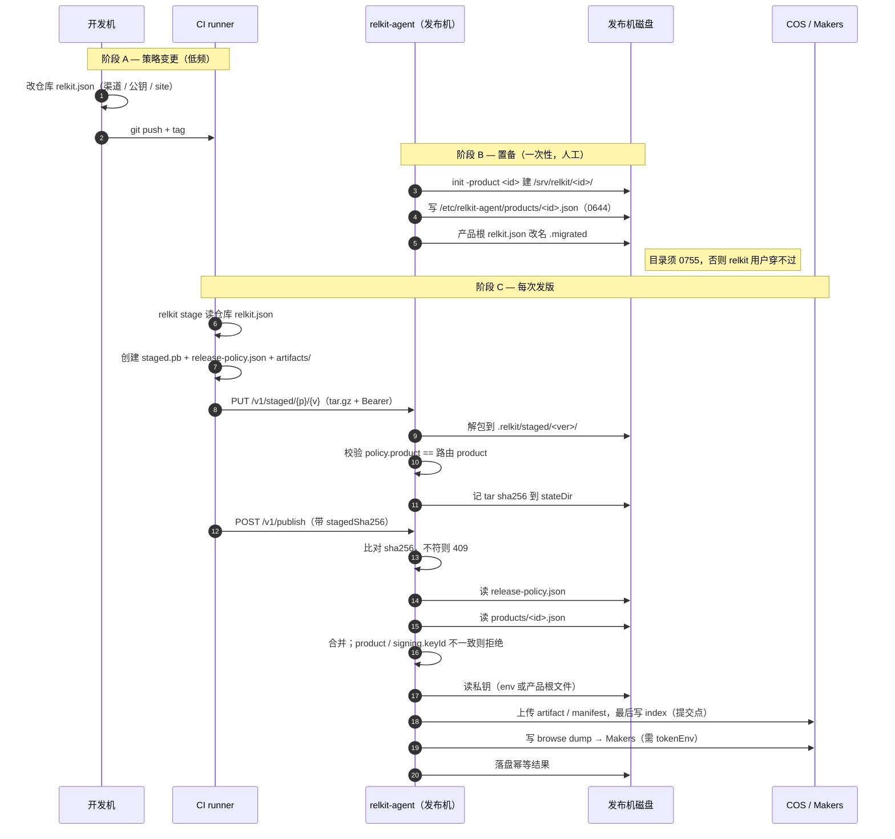

# 待定：发布配置拆分的现场经验

> 状态：草稿。**用本文决定哪些经验进正式文档**；执行清单另见 [`2026-09-01-today.md`](2026-09-01-today.md)，两份都用完即删。  
> 来源：2026-09-01 公网发布机（`publish.firoyang.com` / Dec `dev/v1.13.48`）以及随后关于「要不要兼容」的讨论。  
> 代码现状：拆分已在 `main` 的 `801b382` / `6c78d29`；去掉运行时 fallback 的改动在工作区，**尚未提交**。

---

## 0. 拓扑：机器 / 进程 / 数据

### 0.1 全景图

三层含义：**方框 = 机器**，圆角节点 = 进程，圆柱 / 文档节点 = 数据（配置与产物，标注绝对路径）。边上的序号即发生顺序。

要点：

- **CI 机上没有任何密钥**，只有 `RELKIT_AGENT_TOKEN`。私钥与 COS 密钥从不离开发布机。
- `merged` 只存在于 agent 内存，**不落盘**。没有第三份配置文件。
- `relkit.json.migrated` 画成灰色：在场，但不在任何一条读取边上。
- 客户端只连数据面，永不连 agent。

### 0.2 时序：谁在什么时候创建、更新、读取

### 0.3 配置文件清单

| 路径 | 所属机器 | 谁创建 | 谁更新 | 谁读 | 何时读 |
|---|---|---|---|---|---|
| `<repo>/relkit.json` | 开发机 / CI checkout | 人 | 人（PR） | `relkit stage` | 阶段 C 开头 |
| `.relkit/staged/<ver>/release-policy.json` | CI → 随包搬到发布机 | `relkit stage` | 每次发版重建 | agent | publish 时 |
| `/etc/relkit-agent/relkit-agent.json` | 发布机 | `install-agent.sh` | `init -product` | agent | 启动时 |
| `/etc/relkit-agent/products/<id>.json` | 发布机 | `init -migrate-profile` 或手写 | 人（换 backend / keyId） | agent | publish 时 |
| `/etc/relkit-agent/token` | 发布机 | 安装脚本 | 轮换时 | agent | 启动时 |
| `/etc/relkit-agent/env` | 发布机 | 人 | 人 | systemd → agent 环境 | 启动时，**改后须 restart** |
| `/srv/relkit/<id>/.relkit-keys/*.private.pb` | 发布机 | 人 | 极少 | `publish.Run` | 签名时 |
| `/var/lib/relkit-agent/**` | 发布机 | agent | agent | agent | 幂等回放 |
| `/srv/relkit/<id>/relkit.json.migrated` | 发布机 | 迁移改名 | 无 | **无人** | 从不 |

### 0.4 第二台机（内网 WOA）

同构，只换数据面：profile 里 `publishTo` 指 `local`，backend 写 `outputDir`（如 `/data/relkit-serve`），由 `relkit-serve` / nginx 对外匿名 GET。控制面仍是 agent + 同一套 policy/profile 拆分，没有 Makers 那一段。

> 待核：本文只据设计文档 §7 描述内网形态，未在本次验收中实测。

---

## 1. 产品策略和机器 profile 必须拆开

CI 打出来的包只能带**可移植、可进仓库的策略**：产品名、渠道、保留策略、公钥、人页文案、Makers 项目 ID。

私钥路径、COS/RUP backend、`publishTo`、token 环境变量名，只能留在发布机：

`/etc/relkit-agent/products/<id>.json`

把完整 `relkit.json` 从 CI 覆盖到服务器，会把本机密钥引用冲掉，也会让「仓库里一份、机器上一份」永远对不齐。

## 2. 发布机上的产品根 json 不是真相源（也不再是 fallback）

人页卡在 1.13.45 的根因之一：agent 读的是 `/srv/relkit/dec/relkit.json` 副本。仓库里已经加了 `site.makers`，机器上没有。

**现行真相源只有两份：**

- staged 包里的 `release-policy.json`
- `/etc/relkit-agent/products/<id>.json`

仓库 `relkit.json` 只给本地 / CI 的 `relkit stage` 抽 policy。发布机产品根若还留着旧副本，迁完 profile 后应改名为 `relkit.json.migrated` 或删除；**agent 不再读它**。

（旧稿曾写「无 policy 时 fallback 产品根 json」。已否决：规模小，尾巴会变成第二真相源。）

## 3. 迁移后权限比配置更容易踩

`relkit-agent init -migrate-profile` 用 root 跑完，profile 目录如果是 `0700`，服务用户 `relkit` 进不去。

- 目录要能穿过：`0755`
- 文件可以 `0644`（里面没有密钥明文）

这是 `6c78d29` 专门修的。新 init 已按此写目录权限。

## 4. 密钥永远不进配置文件，但 env 必须跟服务走

token / COS / EdgeOne 走 systemd `EnvironmentFile`。改了 env **必须重启** agent，否则人页部署会静默跳过。

KeyStore 发布 token 过期是另一条线：换 token 不等于人页就能更新。

## 5. 钉版本要用完整 SHA

CNB 上 `git fetch origin 6c78d29` 这种短 SHA 会失败。Dec 要钉 relkit，写完整：

`6c78d29fbd54efa87e6adf189fb9b7b277accd7c`

sparse checkout 也要先 fetch heads 再 checkout，不能假设短哈希一定能解析。

## 6. 验收看三件事，不要只看流水线绿

1. agent 日志：`publish config: staged release-policy.json + .../<id>.json`
2. 产物：`updates.firoyang.com` RUP 200
3. 人页：`update.firoyang.com`（EdgeOne Pages / Makers），不是 RUP 域名

三个域名不要混：`updates` / `raw` 是 COS，`update` 是人页，`publish` 是 agent。

## 7. 发布路径只有一条，不要兼容尾巴

- 有 policy、有 profile → 合并后发布
- 缺 policy 或缺 profile → **失败**
- 不要再猜产品根 `relkit.json`，也不要猜一份默认配置
- `POST /v1/publish` 若带 `stagedSha256`，必须和 `PUT /v1/staged` 时记下的哈希一致

两台机、几个产品，干净迁完即可。运行时兼容只会留下第二份会被人改的配置。

`-migrate-profile` 仍是一次性迁机工具：抽出 profile 后把产品根 `relkit.json` 改名为 `.migrated`。已迁过的产品（profile 已存在）不要再跑这个开关，手工挪开遗留文件。

## 8. 多产品共用一台机时，profile 才是产品差异

`dec` 和 `cronkit` 可以共用 agent token，但各自一份 `products/<id>.json`、各自 `signing.keyId`、各自 `publishTo`。

cronkit 的旧产品根 json 里 `site.homepage` 是空的、也没有 makers——发它之前要先确认人页要不要跟 Dec 同一套，别假设「Dec 通了 cronkit 就通了」。

---

## 9. 事故：人页停在 1.13.45（协议面已经是 1.13.47）

这是拆配置的直接起因。当时容易误判成「agent 没部署 / relkit 没提交」。

实际分层：

| 通道 | 域名 | 当时状态 | 缺什么就会停 |
|---|---|---|---|
| 协议面（SDK） | `updates.firoyang.com` / `raw.firoyang.com` | index 已有 1.13.47，产物 200 | COS 密钥、私钥、profile backends |
| 人页（浏览器） | `update.firoyang.com`（EdgeOne Pages / Makers） | 停在 1.13.45 | **另外**还要 `site.makers` + `EDGEONE_PAGES_API_TOKEN` 进进程 |
| 控制面 | `publish.firoyang.com` | `POST /v1/publish` 已 200 | agent token |

叠了三层，缺任一都会「流水线绿、网页旧」：

1. **env 没进进程。** `/etc/relkit-agent/env` 当时只有 COS 两把钥匙。缺 `EDGEONE_PAGES_API_TOKEN` 时，协议面照发，人页按设计打 warning 后**静默跳过**（`human index will not be deployed`）。改 env 必须 `systemctl restart`。
2. **agent 读的不是仓库那份 json。** 进程里有了 token 仍跳过：读的是 `/srv/relkit/dec/relkit.json`，没有 `site.makers`。Git 仓里已经有。手工改服务器副本 + `allowBackfill` 重发 1.13.47 是止血，不是方案。
3. **三套 token 不是一回事。** KeyStore 的 CI→agent 上传 token、COS 密钥、EdgeOne Pages token。换 KeyStore 过期 token ≠ 人页会更新。
4. **Dec 钉的 relkit 短 SHA 在 CNB 解析失败**；真正 `publish.Run` 是发布机 agent，不是 `third_party/relkit`。vendored CLI 只管 `stage`。

结论（已执行）：不要再维护产品根整份 `relkit.json` 当发布配置；policy 随包走，机器能力留 profile。

## 10. 讨论里改过口的结论（以最后一次为准）

| 议题 | 先怎么说 | 后来怎么定 |
|---|---|---|
| 仓库是不是「唯一产品配置真相源」 | 一度想让仓库 `relkit.json` 当唯一真相 | **拆成两份真相**：仓库/CI 只对 portable 策略负责；机器能力只在 profile。CI 禁止用 staged 改 backend / 读任意服务器环境变量（policy 字段白名单）。 |
| 产品根 json 还在 = 还会双写？ | 文件还在就会漂 | **在场但惰性 ≠ 双写。** 新路径不读它。用户要求：既然不读，就不要留成会有人去改的第二份——迁完改名 `.migrated` 或删除。 |
| 运行时兼容 | 计划里写「旧包无 policy 则 fallback 产品根 json」；`801b382` 已实现 | **否决。** 两台机、几个产品，干净迁完即可。缺 policy 或缺 profile → 失败。不猜默认配置。 |
| `-migrate-profile` | 抽出 profile，**留下**根上 json 作 fallback | 一次性迁机工具；抽出后把产品根改名为 `relkit.json.migrated`。profile 已存在则拒绝覆盖，已迁产品**不要再跑**，手工挪遗留文件。 |
| 合并结果落盘吗 | （未强调） | 只在 agent **内存**合并，不写第三份 json。 |
| 统一公网域名 | 事故后建议减少 `update` / `updates` / `raw` 混用 | **近期不改 DNS。** 文档里必须写清三套用途，验收时分开查。 |
| 人页失败要不要让整次 publish 失败 | 曾建议漂移直接报错、不许静默跳过人页 | **未改代码。** 仍可能协议面 200、人页跳过。要不要变成硬失败，正式文档里应单独开一条「待决」，不要假装已经保证。 |
| `PUT /v1/staged` 无 policy | 解包仍成功，publish 才失败 | 与「不留尾巴」不一致。今日清单：上传即 400。 |
| 在哪条 git 线上改 | 曾考虑另开分支 | **直接 `relkit` `main`。** `review/node-sdk` 已合进 main。 |
| cronkit | 想用同一套发版验收 | 本机无可用 checkout；发布机有产品与 profile。人页策略未定，**不能**用 Dec 发版成功代替 cronkit 验收。 |

规模理由（用户口径）：现在只有两台服务器、几个项目，靠 agent 干净迁移比留兼容便宜。不要给自己留尾巴。

## 11. 现场约束（写进运维说明即可，不必进 SPEC）

- 发布机：`cvm-gz` / `ins-78r3y0si` / `43.138.156.146`；`publish.firoyang.com` → nginx+certbot → `127.0.0.1:8787`（`:80` 已被 nginx 占用，空机才用 Caddy 样例）。
- 产品根：`/srv/relkit/{dec,cronkit}`；profile：`/etc/relkit-agent/products/{dec,cronkit}.json`；共用一份 `/etc/relkit-agent/token`。
- 二进制验收过：`relkit-agent 0.1.3+6c78d29`；Dec `v1.13.48` 日志已是 `staged release-policy.json + .../dec.json`。
- 本会话后半段 TAT `RunCommand` 对这台机无权限，文件是否已改名需 SSH 再核。
- 内网第二台（WOA `local` backend）本次**没实测**，拓扑 §0.4 只是同构推断。
- init 用 root 跑时：`products/` 目录 `0755`、profile 文件 `0644`（无密钥明文）。`6c78d29`。
- 产品树根永远是 `products.<id>.root`，不以 JSON 文档里的路径为准。
- `init -product` 只建 root、写 map，**不**生成 policy / profile / 私钥 / 新 token。

## 12. 沉淀决策（定稿时逐条勾）

勾完再改正式文档；本文件不是设计真相源。

### 应进 `docs/design/publish-agent.md` + `cmd/relkit-agent/README.md`

硬规则，写短、写死：

- [ ] 发布只合并 staged `release-policy.json` + `/etc/relkit-agent/products/<id>.json`；缺一失败；合并结果不落盘
- [ ] policy 白名单 / profile 白名单（私钥路径、backends、`publishTo`、`tokenEnv` 不得进包）
- [ ] `product` 与 `signing.keyId` 不一致则拒绝
- [ ] 产品根 `relkit.json` 不是 agent 配置；迁完改名或不存在
- [ ] `-migrate-profile` 是一次性工具，拒绝覆盖已有 profile
- [ ] env 在 `EnvironmentFile`，改后必须重启；密钥不进 JSON
- [ ] 根路径以 agent 配置为准
- [ ] 拓扑：CI 无密钥；客户端不连 agent；index 是版本提交点
- [ ] profile 目录权限（root init → 服务用户可读）
- [ ] 验收三件事 + 四套域名分工（`publish` / `updates` / `raw` / `update`）——至少 agent README 或公网部署段要有一张表

工作区里上述多数已改过一版；定稿时对照「无 fallback」再扫一遍，避免文档里还留 §5.2 旧句。

### 应进 Dec `UPDATE_ARCHITECTURE.md`（或 `third_party/README.md`），不要写进 relkit SPEC

- [ ] 钉 relkit **完整 SHA**；CNB 短 SHA fetch 会失败；sparse 先 fetch heads 再 checkout
- [ ] CI 只 `stage` + 上传；publish 在发布机
- [ ] 人页域名不是 RUP 域名；流水线绿不等于 `update.firoyang.com` 已更新

### 应进代码（文档只声明行为）

- [ ] 去掉运行时 fallback（工作区已做，待提交）
- [ ] `PUT /v1/staged` 无 `release-policy.json` → 400（今日待办，未做）
- [ ] （待决）缺 Makers token / 缺 `site.makers` 时，publish 是 warning 继续还是非 2xx

### 不要进正式设计（事故细节 / 一次性现场）

- 1.13.45 vs 1.13.47 的时间线、手工 patch 服务器 json、`allowBackfill`
- 具体 IP、实例 ID、某次 TAT 没权限
- 「曾经有 fallback」的实现史（正式文档只写现行规则）
- KeyStore 某日过期（可在运维说明写「三条凭据分开」，不要写进 SPEC）
- cronkit 尚未发版——那是今日待办，不是架构

### 明确否决、以后有人再提时翻这篇

- 把完整 `relkit.json` 从 CI 覆盖到 `/srv/relkit/<id>/`
- 无 policy 时读产品根 json
- 有 policy 无 profile 时拼一份默认配置
- 为「旧 CLI 硬发一版」长期留第二真相源
- 用 Dec 发版成功代替 cronkit 验收

---

执行与提交见 [`2026-09-01-today.md`](2026-09-01-today.md)。
