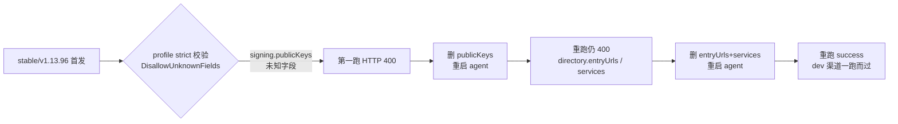

# 待定：agent strict 校验清掉旧 profile 冗余（裁决：本就不该兼容）

> 状态：草稿。用本文决定哪些经验进正式文档，用完即删。
> 来源：2026-09-26 dec 双渠道发布（`stable/v1.13.96` 首发两跑两败，`dev/v1.13.97` 修复后一跑而过）。
> 现场：公网发布机（`publish.firoyang.com`）当日升级新版 agent（relkit `94b2ef5`）后首次发布。
> 裁决（用户，2026-09-26）：**本来就不应该兼容。** 机器 profile 的 strict 校验（拒绝未知字段）是设计基线；旧 agent 的宽松解析才是偏差。不做兼容垫片，不做迁移工具。

---

## 0. 事件概要

stable 渠道首发在 `cas/credentials` 步骤连续失败两次，根因同源：新版 agent 对产品 profile（`/etc/relkit-agent/products/<product>.json`）启用 strict 解析（`DisallowUnknownFields`），而发布机上的旧 profile 带着旧版宽松解析容忍的冗余字段，分两轮暴露。删除字段并重启 agent 后，重跑成功；随后 dev 渠道同路径一次通过。

## 1. 被拒字段与设计语义

strict 校验拒绝的不是「新配置写错」，而是「旧配置里本就不该有的冗余」：

| 字段 | 设计归属 | 为何机器 profile 不应有 |
|---|---|---|
| `signing.publicKeys` | 产品仓 `release-policy.json` | 公钥 SSOT 在产品策略，防发布机私钥与产品公钥配对错误；`PublishProfile.Signing` 刻意只读 `keyId` + `privateKeyPath` |
| `directory.entryUrls` | 产品仓 `release-policy.json` | directory 文档内容由 staged 树的 release-policy 决定，机器只声明 `publishTo` |
| `directory.services` | 产品仓 `release-policy.json` | 同上，客户端概念随 staged 树走 |

结论：strict 校验拒绝这些字段**不是升级引入的破坏，而是收掉本就不该存在的兼容**。旧 agent 宽容未知字段，才让冗余静默存活至今；删字段是清欠账，strict 是防止欠账再累积的正确基线。

## 2. 判定方法（下次直接复用）

症状：CI 的 publish job 在 `cas/credentials` 步骤 exit 2，agent 日志出现 `is not a valid publish profile`（HTTP 400）。

判定链：
1. `gh run view <id> --log-failed` 定位到 `cas/credentials` 失败。
2. `ssh publish.firoyang.com 'sudo cat /etc/relkit-agent/products/<product>.json'` 看被拒字段。
3. 对照 relkit 源码 `internal/config/policy.go` 的 `PublishProfile` / `PublishDirectoryProfile` 结构体——合法字段集即结构体字段集。
4. 删冗余字段 → `systemctl restart relkit-agent` → `gh run rerun <id> --failed`。

## 3. 进正式文档的候选

- [ ] `docs/publish-agent.md`：机器 profile 的字段语义表（哪些字段属于机器、哪些属于产品仓 release-policy），并注明 strict 校验自 agent 新版起生效。
- [ ] agent README：strict 解析的报错文案与排障链路（症状 → 看日志 → 对照结构体 → 删字段 → 重启 → rerun）。
- [ ] ADR 候选：把裁决落成文——机器 profile schema **不承诺向后兼容**，未知字段一律 hard fail，无迁移工具、无兼容垫片。agent 升级 runbook 至多加一条「升级前扫描 products/*.json 未知字段」的操作提示，定位是清欠账，不是兼容。

## 4. 不进正式文档的理由候选

- 一次性事件：公网面所有产品 profile 已收敛，长期无复现面。
- 内网发布面（`update.devcloud.woa.com`）已于 2026-09-26 核验干净：agent 已是 `0.4.24+94b2ef5`（strict 校验已生效），`products/` 下仅 `loom.json`、`svn-auto-merge.json` 两个 profile，字段集与 `policy.go` 结构体逐一吻合（signing 仅 `keyId`/`privateKeyPath`，directory 仅 `publishTo`），无 `publicKeys`/`entryUrls`/`services` 冗余。全拓扑无复现面，悬念收口。

## 5. 现场操作记录（备查）

- stable 首跑：run 36229811789 失败（`signing.publicKeys`）。
- 二跑：删 `publicKeys` 后仍失败（`directory.entryUrls` + `directory.services`）。
- 三跑：两字段全删、agent 重启后 success，stable 索引 200，`relkit verify` 33 工件全过。
- dev 发布：`dev/v1.13.97` 一跑 success（20m43s），佐证修复有效。
- 发布机 profile 修改是幂等 JSON 重写（`json.dump`），改前原始内容已在本地会话输出中留档。
