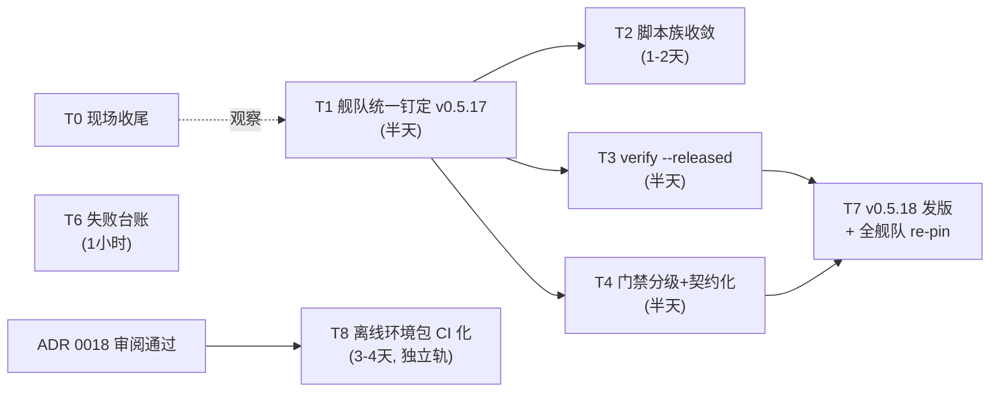

# CI 发布链路修复计划（临时任务文档）

- 状态：草稿待审阅
- 日期：2026-10-04
- 来源：三个 agent 系统性排查报告的综合裁决（约 90 条历史失败事件 → 六类失败模式）
- 范围：五产品（loom / loom-launcher / SvnMergeTool / Dec / cronkit）+ relkit 主仓
- 铁律：全程不动 stable 渠道、不动 relkit 主干架构；T1-T7 不引入新网络面。T8（独立轨）经用户五次裁决引入 mirrors 通道替代 ci-env 孤儿分支通道（ADR 0018 五修），不属本铁律约束范围

## 0. 背景与结论

三个报告共识成立：修复传播靠手工横向复制（E 桶），五产品钉在五个不同的 relkit 版本（v0.5.7 / v0.5.11 / v0.5.12 / v0.5.13 / v0.5.15），是"修好又坏"的主凶。环境类（A 桶）与编排耦合（B 桶）已由 ci-env 孤儿分支 + 两阶段构建 + PAC yaml 冻结铁律根治（10-01 落地，10-02 三批 15 连发全绿实证）。遗留六个结构性缺陷，对应 T1-T4 + T6 五个任务（T5 救急通道已于 2026-10-04 用户裁决砍掉，见第 10 节），T7 为收尾发版。

本轮细化新增实证（三个报告均未覆盖）：

1. cronkit 仓内双版本混杂：workflow 4 处 v0.5.11 + package.json/README/scripts 5 处 v0.5.9
2. SvnMergeTool 有现成的 lock 更新工具 update_relkit_lock.py（8.9KB 带测试），re-pin 无需新写工具
3. relkit CLI 已有 22 个子命令，verify / directory 已存在，T3 是扩展而非新建
4. 脚本族漂移实测：三仓 hostlib 8 个文件逐字节一致，但 SvnMergeTool 的 relkit_cli.py 分叉 2.2KB、launcher 的 gates.py 落后一版、三仓三个 lock 版本

2026-10-04 追加议题（离线环境包，→ T8 / ADR 0018）：ci-env 机制三个残留缺陷同根——打包在开发者本机手工执行。打包半衰期（+60 漏 14 个 rustup 垫片、+61 junction 顺序倒挂，盲区随打包间隔积累）；跨平台缺失（loom ci_prepare_env.ps1:16 钉死 windows-amd64、svn ci_prepare_env.py:227 非 Windows 直接跳过，而 svn 发布矩阵含 mac，mac job 走 goproxy 网络自举、无离线保障）；重打包成本（每次 re-pin 手工重打全量 bundle，实测当前分支约 750 MB：rust-toolchain 510 + npm-deps 146 + node 41 主导，且本机组装 zip 重打即字节漂移，每次全量重打在服务端 LFS 留数百 MB 新对象）。用户拍板：保留内网离线机制，打包进 relkit 发布链下游子流程（多平台、不阻塞主发布、开发者零参与）。用户二次裁决：分层通过；设计意图为单分支只存最新版、不留历史（该意图随五修的 mirrors 版本化路径以新形态延续——新版本即新路径，旧代由保留策略清理）。用户三次裁决（拆包，后随五修作废）：bundle 改裸文件树 + manifest 直存分支，动机为 git blob 内容寻址零传输。用户四次裁决（弃 LFS，后随五修作废）：内网分支普通 blob 直存换掉 LFS，动机为旧代对象 GC 可回收。用户五次裁决（存储与分发整体换血，现行方案）：git 仓库当文件服务器的全部方案废弃——GitHub 侧离线环境文件只进 Release 构建产物、不进任何仓库分支；内网存储位改为腾讯软件源 mirrors Generic 仓库（mirrors.tencent.com，研发管理部运营，bk-repo + 内网 COS 底层，99.9% SLA），`relkit` 公开仓库当日创建（repo id 9871，owner firoyang）并端到端实证：建仓 API / PUT 上传 / X-Checksum-Sha256 校验头 / 公开匿名下载 / list / DELETE 全通，已存在文件 PUT 不可覆盖（不可变制品保护）；内网侧由新增蓝盾下载流水线从 GitHub Release 拉资产上传 mirrors 版本化路径，消费端构建机阶段 1 改 HTTP 下载（win/mac/linux 同构），非 CI 环节清零（摆渡器作废）；bundle 形态回归分层 zip + manifest（git 内容寻址动机消失，解压物化环节回归是唯一真实回退）。已回写 ADR 0018（决策 2/4/5/9/10、流程图、结果、开放问题整体重写）与第 8 节 T8 分解（T8.0/T8.1/T8.3/T8.4/T8.5 全部按 mirrors 方案换血）。方案全文：[ADR 0018 草稿](../adr/0018-offline-env-pack-in-ci.md)

## 1. 任务总览与依赖图

- 执行顺序：T1 → (T2、T3、T4 并行) → T7；T6 独立可随时做
- T8 独立成轨：ADR 0018 审阅通过后启动，不阻塞 T1-T7；其 relkit 层随 tag 自动前进与 T1/T7 的 re-pin 天然配套
- T1-T7 总工作量约 3 个工作日，全程无需用户介入（自主推进授权已在记忆中）
- T0 现场收尾：launcher 0.1.0+27 仍在串行队列（tag 已带钉定修复），无需干预，开工时顺带确认落地

## 2. T1 舰队统一钉定到 v0.5.17（止血，最高优先）

目标：消灭五版本并存，把 master 上两个未发布修复（--allow-backfill 透传 422706d、publish 失败误删 drop be13a7d）送达全部产品。

### 2.1 先发 relkit v0.5.17

`relkit version set 0.5.17` + CHANGELOG 补节（含 d7cb969 browse 修复）+ 打 tag 推送 → release.yml 自举构建（自举路径已验证多次，v0.5.16 发版走的就是这条路）。

### 2.2 五仓钉定面清单（逐一实测）

| 仓 | 钉定面 | 现状 | 动作 |
|---|---|---|---|
| loom | scripts/relkit.lock.json + ci-env bundle relkit 节 | v0.5.13 | lock 再生成 + ci-env 重打包 |
| loom-launcher | scripts/relkit.lock.json + ci-env bundle | v0.5.12，gates.py 落后一版 | 同上；hostScriptsSha256 顺带追平 |
| SvnMergeTool | scripts/relkit.lock.json | v0.5.15 | 复用仓内现成 update_relkit_lock.py |
| Dec | scripts/relkit.lock.json + workflow 硬编码 6 处 | v0.5.7（workflow 5 处 release.yml + 1 处 upload-bench.yml） | workflow 收敛为顶部单一 RELKIT_REF env；同步检查双 SSOT 的 internal/update/embed/relkit.json |
| cronkit | 硬编码 9 处 | workflow 4 处 v0.5.11 + package.json/README/scripts 5 处 v0.5.9 | 全数收敛为单一版本常量；脚本/文档改引用已安装的 tools/bin/relkit，不再 go run @版本 |

注：T8 落地后，loom/launcher 的 ci-env 重打包一步被 T8 的蓝盾下载流水线 + mirrors 版本化路径替代（relkit 层自动前进，git 分支通道退役）；T1 执行时若 ADR 0018 尚未批准，仍按手工重打包走。

### 2.3 步骤

1. relkit 主仓发 v0.5.17（见 2.1）
2. 五仓逐仓钉定（2.2 表），每仓一个独立 commit，便于单仓 revert
3. loom/launcher 的 ci-env 重打包照 ADR 0017 loom-env/1 流程走，.gitattributes 必须在提交里（过渡期现状流程；T8 落地后 git 分支通道整体退役，该步骤消失）
4. 每仓发一次 dev 版本验证（顺带完成一轮惯例验证矩阵）

### 2.4 验收与回退

- 验收：五仓 lock/env 引用全部指向 v0.5.17；五次 dev 发布全绿
- 回退：各仓单 commit revert 即可，互不牵连

## 3. T2 内网三仓脚本族收敛（结构性解，消灭传播缺陷本体）

目标：把 loom / launcher / SvnMergeTool 仓里的 Python 全家桶（host/hostlib/ 12 个模块 + relkit_consume.py 48.6KB + relkit_cli.py + relkit_host.py，合计约 230KB/仓）撤出，改为 ci-env 分发的 relkit.exe 直调（cronkit/Dec 已验证形态：`relkit ci release --channel X --execute` 一行入口），各仓只留产品特有 packScript 和薄 cmd 包装。

### 3.1 迁移顺序（按风险递增）

1. 先导仓 SvnMergeTool：产物最小、自带 test_relkit_cli.py 测试面、其 relkit_cli.py 本来就是 2.2KB 分叉版——收敛后分叉自动消失
2. 迁完连发 3 个 dev 版本验证
3. 再推 loom
4. 最后 launcher（带 NSIS/junction 特有逻辑，风险最高放最后）

### 3.2 前提校验与顺手项

- 前提校验：v0.5.17 CLI 的 releasegate/onboarding 覆盖等价于 gates.py 现有检查点，缺什么先在 relkit 侧补
- 顺手项：把 svn 的 update_relkit_lock.py 泛化为 relkit 的 `lock bump` 子命令，未来 re-pin 变成一条命令
- 回退：git revert 单仓即可，三仓互不牵连

## 4. T3 发布后验证固化（替代不可靠的蓝盾 MCP 观测）

目标：把这两天人工兜底的"curl .pb 索引 + sequence 检查 + channel 校验"固化成机器步骤。

### 4.1 落点

扩展 cmd/relkit/verify.go 增加 `verify --released` 模式，入参 `--product --channel --expect-version`，检查三件事：

1. 索引 .pb 可达且含目标版本
2. directory sequence 单调无回退（防 SvnAutoMerge seq 7 < 29 那类锁死）
3. manifest schema /2 校验通过

注：T5 救急通道砍掉后，第 2 项 sequence 单调检查就是序号回退问题的唯一暴露点——发布时序号回退即红，不留事后处置路径。fallback URL 检查随 T5 裁决一并移除。

### 4.2 接入方式

- 挂到各仓 CI 发布链末尾作为收尾硬门（发布成功但验证失败 = 红）
- 同时支持手工独立调用
- 随 v0.5.18 发出（见 T7）

### 4.3 构建侧观测：用 dec-devops skill 替代蓝盾 MCP

蓝盾 MCP 的掉线、OAuth 超时、只统计控制台发布次数等问题，改用已装的 dec-devops skill（蓝盾官方 API 的 Python 客户端全家桶，自动换票续期）承接 agent 侧观测：

- 构建状态轮询与假绿假红识别：`scripts/devops_build_status.py`（诊断路由见 `references/insight/build-status.md`）
- 失败下钻：`scripts/download_log.py` 按 elementId 拉原始日志 + `references/insight/error-patterns.md` 错误模式库
- 构建对照：`scripts/devops_build_history.py` / `devops_build_diff.py`

这一层跑在发布机/本机侧，只读不写，不进 CI 链路。CI 链内的收尾硬门仍由 verify --released 承担，两层合起来彻底替换蓝盾 MCP 观测。

## 5. T4 门禁分级 + 契约化改造

### 5.1 文本断言改契约测试

loom 的 scripts/ci.test.mjs 中断言其他脚本文本的正则（doesNotMatch relkit_host.py、match RELKIT_RELEASE_VIA_CI=1 等）改为契约测试：实际 spawn ci.mjs --help / dry-run stage 验证行为，而非 grep 源码——重构不再等于破坏。

### 5.2 CHANGELOG 门禁按渠道分级

dev 渠道只要求版本行存在；stable 保留全量小节检查——消掉"8 秒失败"仪式性摩擦（loom 构建 #21 的失败形态）。

### 5.3 随迁裁剪

svn 迁 T2 后，其 33KB 的 test_relkit_cli.py 相应缩减为只测薄包装。

## 6. T6 失败台账五桶化

落 relkit 仓 docs/incidents/failure-ledger.md：

1. 沿用六类标记法：A 环境 / B 编排 / C 排队 / D 门禁 / E 传播 / F 观测协议
2. A/B 标注已根治、只读存档
3. 把本轮排查约 90 条历史事件按桶预填成统计基线
4. 立归档规则：每次新失败必须归桶登记后才能关闭

下次再炸，台账直接告诉你是不是 E 桶复发还是新桶。

## 7. T7 收尾：v0.5.18 发版 + 全舰队廉价 re-pin

T3（verify --released）与 T4 落地后，按 T1 同样流程发 v0.5.18：新 CLI + 各仓 lock 更新 + 每仓一次 dev 验证。此后 re-pin 已是一条命令级操作（T2 顺手项），版本漂移不再有手工横向复制环节。

## 8. T8 离线环境包 CI 化（ADR 0018 实施分解，审阅通过后启动）

前置已满足：[ADR 0018](../adr/0018-offline-env-pack-in-ci.md) 已于 2026-10-04 经用户批准（"继续推进"指示，状态转 Accepted），T8 轨当日启动。独立成轨，不阻塞 T1-T7；约 3-4 个工作日。

- T8.0 盘点与连通性实测（半天）【静态盘点已完成 2026-10-04，剩连通性实测】：盘点结论——蓝盾 mac 池 Intel x64（macos-macOS15.6 / Macmini-5 / xcode 26.3，构建日志 darwin-x64 engine 下载实锤），darwin 覆盖面定案为单 darwin-amd64 包；darwin bundle 基线：Flutter SDK 3.38.3 bundle 自带（不信任 fvm 预置）+ darwin-x64 engine artifacts 7 项 + Go 1.26.3 toolchain + pub 预物化 + CocoaPods + relkit 层（Release darwin-amd64 直引）；xcode 池预置不进包、记入 manifest 残余依赖；mac 现状网络面实测为 goproxy / storage.googleapis.com / pub.dev / CocoaPods CDN 四条公网直连。结论已回填 ADR 0018 开放问题 1（定案）。剩余项：蓝盾构建机→GitHub Release 连通性实测（企业根证书信任 + curl -L 下载 + sha256 校验全链；蓝盾→mirrors 已有 GOPROXY 生产先例视为已验证）；蓝盾机配 HTTP 代理时 COS 302 重定向域名（cos-internal.*.tencentcos.cn）进 no_proxy 的验证（已知 413/401 块）——两项均需经蓝盾侧执行
- T8.1 relkit 仓打包子流程（1 天）：新增 .github/workflows/pack-ci-env.yml（workflow_run 挂 release 成功 + workflow_dispatch + 可选 schedule）+ 打包脚本落仓（纯度铁律：干净 runner 从零下载钉定版本、禁 runner 预装/setup-*/cache）+ 工具链版本清单单一源。bundle 形态分层 zip + manifest（每层一个 zip：toolchain 按平台 / deps 按产品 / relkit 层聚合该 tag 资产；manifest 记层 zip sha256 + 逐文件 path/sha256/size/mode，物化端按 manifest 恢复可执行位）
- T8.2 release.yml 补 darwin CLI 资产 target（若缺）【已证实无需动作 2026-10-04：v0.5.15 起 Release 已含 darwin-amd64 / darwin-arm64 CLI 资产（lock 文件 URL+sha256 证实），build --all 产物面无需补 target】
- T8.3 蓝盾下载流水线（半天）：bkci 新 yaml + 项目脚本——拉 GitHub Release 层产物 → sha256 校验 → PUT 上传 mirrors 版本化路径（basic auth 凭证进蓝盾凭据管理，不落 yaml/仓库；X-BKREPO-EXPIRES: 0 永久）→ list+delete 保留清理（toolchain 严格一份约 570 MB、relkit 留最近 5 代约 22 MB/代）；yaml 冻结铁律：只做 step 编排，逻辑全在项目脚本
- T8.4 manifest loom-env/2 + 消费端改造（1 天）：schema /2 一刀切不留 /1 兼容（沿 v0.5.8 先例）；loom/launcher ci_prepare_env.ps1 的 $Target 参数化 + 物化逻辑改 HTTP 下载（curl -L 拉 mirrors URL，公开仓库匿名）+ 三段式物化（zip sha 校验 → 确定性顺序解压 → 逐文件 sha 校验）；svn ci_prepare_env.py 删非 Windows 跳过分支、mac 阶段 1 改同构 HTTP 物化、阶段 2 全离线；删 .gitattributes LFS 追踪与 smudge/clone 依赖（git 存储通道整体退役）
- T8.5 收尾（半天）：mirrors 存量盘点（保留策略生效确认：toolchain 单份、relkit ≤5 代，超出即 list+delete）；五仓各一次 dev 验证
- 验收：tag 后 bundle 全自动前进（零人工打包动作、零非 CI 环节）；svn mac job 阶段 2 全离线发布一次成功；per-tag 新增上传为 relkit 层量级（约 22 MB），未变层零重传；消费端从 mirrors 匿名 GET + sha 校验物化全绿
- 回退：停用 pack-ci-env.yml + 下载流水线 + 消费端逐仓 revert，回到手工打包现状

## 9. 待用户拍板项

按依赖图自主推进外，以下两项需要用户确认：

1. retainVersions stable 存量残留（dec 3 节点、cronkit 5 节点）是否随 T7 一并清理（2026-10-02 拍板遗留）
2. 【已拍板 2026-10-04】ADR 0018（五修版）：用户确认开放问题 4 解释后指示"继续推进"，按批准处理，状态转 Accepted、T8 轨启动；开放问题 1（darwin 单 amd64 包）与 4（linux 容器维持不动）同日定案。剩余开放问题 2（deps 层生产点）不阻塞 T8.1-T8.4 主线，随 deps 层实际动工再定

## 10. 明确不做（本轮裁决已排除）

1. 产品注册中心 / 发布状态集中化平台方案：过度设计，当前五产品规模下用 T6 台账 + T3 验证脚本即可覆盖
2. 协议窗口（protocol 2-2 vs Current=3）改造：风险仅存在于手工恢复场景，v0.5.17 的 --allow-backfill 代码路径已覆盖，不动协议本身
3. T5 救急通道 runbook（2026-10-04 用户裁决砍掉）：directory sequence 回退处置手册、手工 publish 恢复手册、fallback 文档上线全部不做。用户原则：有问题就该暴露出来、彻底修根因，不做灾后处置文档和救急通道。残留防线：T3 verify --released 的 sequence 单调检查（发布时回退即红）+ relkit v0.5.17 --allow-backfill 代码路径。fallback 代码本体（SPEC §12.6 / internal/fallback）的存废属架构级变更，本轮不动
