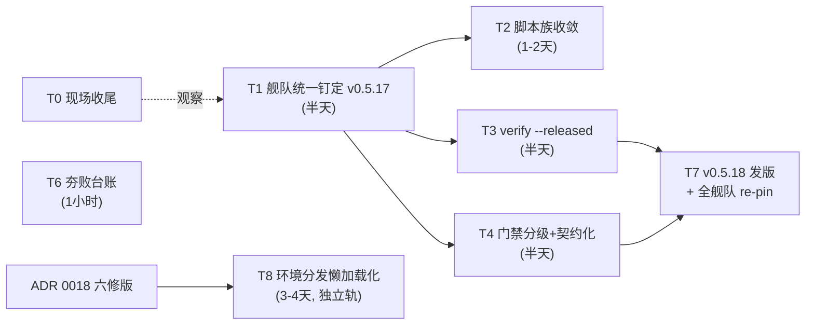

# CI 发布链路修复计划（临时任务文档）

- 状态：草稿待审阅
- 日期：2026-10-04
- 来源：三个 agent 系统性排查报告的综合裁决（约 90 条历史失败事件 → 六类失败模式）
- 范围：五产品（loom / loom-launcher / SvnMergeTool / Dec / cronkit）+ relkit 主仓
- 铁律：全程不动 stable 渠道、不动 relkit 主干架构；T1-T7 不引入新网络面。T8（独立轨）经用户六次裁决引入 mirrors 懒加载通道替代 ci-env 孤儿分支通道（ADR 0018 六修），不属本铁律约束范围

## 0. 背景与结论

三个报告共识成立：修复传播靠手工横向复制（E 桶），五产品钉在五个不同的 relkit 版本（v0.5.7 / v0.5.11 / v0.5.12 / v0.5.13 / v0.5.15），是"修好又坏"的主凶。环境类（A 桶）与编排耦合（B 桶）已由 ci-env 孤儿分支 + 两阶段构建 + PAC yaml 冻结铁律根治（10-01 落地，10-02 三批 15 连发全绿实证）。遗留六个结构性缺陷，对应 T1-T4 + T6 五个任务（T5 救急通道已于 2026-10-04 用户裁决砍掉，见第 10 节），T7 为收尾发版。

本轮细化新增实证（三个报告均未覆盖）：

1. cronkit 仓内双版本混杂：workflow 4 处 v0.5.11 + package.json/README/scripts 5 处 v0.5.9
2. SvnMergeTool 有现成的 lock 更新工具 update_relkit_lock.py（8.9KB 带测试），re-pin 无需新写工具
3. relkit CLI 已有 22 个子命令，verify / directory 已存在，T3 是扩展而非新建
4. 脚本族漂移实测：三仓 hostlib 8 个文件逐字节一致，但 SvnMergeTool 的 relkit_cli.py 分叉 2.2KB、launcher 的 gates.py 落后一版、三仓三个 lock 版本

2026-10-04 追加议题（离线环境包，→ T8 / ADR 0018）：ci-env 机制三个残留缺陷同根——打包在开发者本机手工执行。打包半衰期（+60 漏 14 个 rustup 垫片、+61 junction 顺序倒挂，盲区随打包间隔积累）；跨平台缺失（loom ci_prepare_env.ps1:16 钉死 windows-amd64、svn ci_prepare_env.py:227 非 Windows 直接跳过，而 svn 发布矩阵含 mac，mac job 走 goproxy 网络自举、无离线保障）；重打包成本（每次 re-pin 手工重打全量 bundle，实测当前分支约 750 MB：rust-toolchain 510 + npm-deps 146 + node 41 主导）。用户拍板：保留内网离线机制，打包进 relkit 发布链下游子流程（多平台、不阻塞主发布、开发者零参与）。用户二次裁决：分层通过；设计意图为单分支只存最新版、不留历史。用户三次裁决（拆包，后随五修作废）：bundle 改裸文件树 + manifest 直存分支。用户四次裁决（弃 LFS，后随五修作废）：内网分支普通 blob 直存换掉 LFS。用户五次裁决（存储与分发整体换血）：git 仓库当文件服务器废弃，GitHub 侧只进 Release 产物，内网存储改 mirrors Generic 仓库（repo id 9871 端到端实证全通），蓝盾下载流水线拉 Release 上传，消费端阶段 1 改 HTTP 下载。用户六次裁决（六修，生产与消费模式整体重构，现行方案）：①GitHub Actions 永远无法触发内网蓝盾流水线（硬事实，不验证）；蓝盾手动触发不可靠（"顺便触发"），正常流程从消费方考虑；②消费方 CI 第 0 步阻塞式触发蓝盾同步流水线、指定 relkit 版本，执行完成才放行下一步；③同步流水线消费 GitHub Release 本身，缺资产补 release.yml；④工具链准备弃大环境 zip，改 generic mirror 懒加载回填（mirrors GET → 未命中走官方源朴素下载 → sha256 校验后顺便 PUT 回填 mirrors → 官方源不通则开发者自行上传兜底）；⑤mirrors 读写鉴权，key 进蓝盾环境变量。六修当日现场：pack 三件套删除、两提交回滚（master 回 a01aa85）、ci-env-latest Release 删除、仓库默认分支修正为 master（独立卫生项，保留）。已回写 ADR 0018 六修版全文。方案全文：[ADR 0018](../adr/0018-offline-env-pack-in-ci.md)

## 1. 任务总览与依赖图

- 执行顺序：T1 → (T2、T3、T4 并行) → T7；T6 独立可随时做
- T8 独立成轨：六修版 ADR 0018 已批准，不阻塞 T1-T7；消费方驱动同步与 T1/T7 的 re-pin 天然配套
- T1-T7 总工作量约 3 个工作日，全程无需用户介入（自主推进授权已在记忆中）
- T0 现场收尾：launcher 0.1.0+27 仍在串行队列（tag 已带钉定修复），无需干预，开工时顺带确认落地

## 2. T1 舰队统一钉定到 v0.5.17（止血，最高优先）

目标：消灭五版本并存，把 master 上两个未发布修复（--allow-backfill 透传 422706d、publish 失败误删 drop be13a7d）送达全部产品。

### 2.1 先发 relkit v0.5.17

`relkit version set 0.5.17` + CHANGELOG 补节（含 d7cb969 browse 修复）+ 打 tag 推送 → release.yml 自举构建（自举路径已验证多次，v0.5.16 发版走的就是这条路）。

### 2.2 五仓钉定面清单（逐一实测）

| 仓 | 钉定面 | 现状 | 动作 |
|---|---|---|---|
| loom | scripts/relkit.lock.json + ci-env bundle relkit 节 | v0.5.13 | lock 再生成 + ci-env 重打包 |
| loom-launcher | scripts/relkit.lock.json + ci-env bundle | v0.5.12，gates.py 落后一版 | 同上；hostScriptsSha256 顺带追平 |
| SvnMergeTool | scripts/relkit.lock.json | v0.5.15 | 复用仓内现成 update_relkit_lock.py |
| Dec | scripts/relkit.lock.json + workflow 硬编码 6 处 | v0.5.7（workflow 5 处 release.yml + 1 处 upload-bench.yml） | workflow 收敛为顶部单一 RELKIT_REF env；同步检查双 SSOT 的 internal/update/embed/relkit.json |
| cronkit | 硬编码 9 处 | workflow 4 处 v0.5.11 + package.json/README/scripts 5 处 v0.5.9 | 全数收敛为单一版本常量；脚本/文档改引用已安装的 tools/bin/relkit，不再 go run @版本 |

注：T8 落地后，loom/launcher 的 ci-env 重打包一步被消费方驱动的蓝盾同步流水线 + mirrors 懒加载回填替代（git 分支通道退役）；T1 执行时 T8.2 未完成前，仍按手工重打包走。

### 2.3 步骤

1. relkit 主仓发 v0.5.17（见 2.1）
2. 五仓逐仓钉定（2.2 表），每仓一个独立 commit，便于单仓 revert
3. loom/launcher 的 ci-env 重打包照 ADR 0017 loom-env/1 流程走，.gitattributes 必须在提交里（过渡期现状流程；T8.2 落地后同步流水线 + 懒加载通道接管，git 分支通道退役，该步骤消失）
4. 每仓发一次 dev 版本验证（顺带完成一轮惯例验证矩阵）

### 2.4 验收与回退

- 验收：五仓 lock/env 引用全部指向 v0.5.17；五次 dev 发布全绿
- 回退：各仓单 commit revert 即可，互不牵连

## 3. T2 内网三仓脚本族收敛（结构性解，消灭传播缺陷本体）

目标：把 loom / launcher / SvnMergeTool 仓里的 Python 全家桶（host/hostlib/ 12 个模块 + relkit_consume.py 48.6KB + relkit_cli.py + relkit_host.py，合计约 230KB/仓）撤出，改为 ci-env 分发的 relkit.exe 直调（cronkit/Dec 已验证形态：`relkit ci release --channel X --execute` 一行入口），各仓只留产品特有 packScript 和薄 cmd 包装。

### 3.1 迁移顺序（按风险递增）

1. 先导仓 SvnMergeTool：产物最小、自带 test_relkit_cli.py 测试面、其 relkit_cli.py 本来就是 2.2KB 分叉版——收敛后分叉自动消失
2. 迁完连发 3 个 dev 版本验证
3. 再推 loom
4. 最后 launcher（带 NSIS/junction 特有逻辑，风险最高放最后）

### 3.2 前提校验与顺手项

- 前提校验：v0.5.17 CLI 的 releasegate/onboarding 覆盖等价于 gates.py 现有检查点，缺什么先在 relkit 侧补
- 顺手项：把 svn 的 update_relkit_lock.py 泛化为 relkit 的 `lock bump` 子命令，未来 re-pin 变成一条命令
- 回退：git revert 单仓即可，三仓互不牵连

## 4. T3 发布后验证固化（替代不可靠的蓝盾 MCP 观测）

目标：把这两天人工兜底的"curl .pb 索引 + sequence 检查 + channel 校验"固化成机器步骤。

### 4.1 落点

扩展 cmd/relkit/verify.go 增加 `verify --released` 模式，入参 `--product --channel --expect-version`，检查三件事：

1. 索引 .pb 可达且含目标版本
2. directory sequence 单调无回退（防 SvnAutoMerge seq 7 < 29 那类锁死）
3. manifest schema /2 校验通过

注：T5 救急通道砍掉后，第 2 项 sequence 单调检查就是序号回退问题的唯一暴露点——发布时序号回退即红，不留事后处置路径。fallback URL 检查随 T5 裁决一并移除。

### 4.2 接入方式

- 挂到各仓 CI 发布链末尾作为收尾硬门（发布成功但验证失败 = 红）
- 同时支持手工独立调用
- 随 v0.5.18 发出（见 T7）

### 4.3 构建侧观测：用 dec-devops skill 替代蓝盾 MCP

蓝盾 MCP 的掉线、OAuth 超时、只统计控制台发布次数等问题，改用已装的 dec-devops skill（蓝盾官方 API 的 Python 客户端全家桶，自动换票续期）承接 agent 侧观测：

- 构建状态轮询与假绿假红识别：`scripts/devops_build_status.py`（诊断路由见 `references/insight/build-status.md`）
- 失败下钻：`scripts/download_log.py` 按 elementId 拉原始日志 + `references/insight/error-patterns.md` 错误模式库
- 构建对照：`scripts/devops_build_history.py` / `devops_build_diff.py`

这一层跑在发布机/本机侧，只读不写，不进 CI 链路。CI 链内的收尾硬门仍由 verify --released 承担，两层合起来彻底替换蓝盾 MCP 观测。

## 5. T4 门禁分级 + 契约化改造

### 5.1 文本断言改契约测试

loom 的 scripts/ci.test.mjs 中断言其他脚本文本的正则（doesNotMatch relkit_host.py、match RELKIT_RELEASE_VIA_CI=1 等）改为契约测试：实际 spawn ci.mjs --help / dry-run stage 验证行为，而非 grep 源码——重构不再等于破坏。

### 5.2 CHANGELOG 门禁按渠道分级

dev 渠道只要求版本行存在；stable 保留全量小节检查——消掉"8 秒失败"仪式性摩擦（loom 构建 #21 的失败形态）。

### 5.3 随迁裁剪

svn 迁 T2 后，其 33KB 的 test_relkit_cli.py 相应缩减为只测薄包装。

## 6. T6 失败台账五桶化

落 relkit 仓 docs/incidents/failure-ledger.md：

1. 沿用六类标记法：A 环境 / B 编排 / C 排队 / D 门禁 / E 传播 / F 观测协议
2. A/B 标注已根治、只读存档
3. 把本轮排查约 90 条历史事件按桶预填成统计基线
4. 立归档规则：每次新失败必须归桶登记后才能关闭

下次再炸，台账直接告诉你是不是 E 桶复发还是新桶。

## 7. T7 收尾：v0.5.18 发版 + 全舰队廉价 re-pin

T3（verify --released）与 T4 落地后，按 T1 同样流程发 v0.5.18：新 CLI + 各仓 lock 更新 + 每仓一次 dev 验证。此后 re-pin 已是一条命令级操作（T2 顺手项），版本漂移不再有手工横向复制环节。

## 8. T8 环境分发懒加载化（ADR 0018 六修版实施分解）

前置已满足：[ADR 0018 六修版](../adr/0018-offline-env-pack-in-ci.md) 已于 2026-10-04 经用户批准，T8 轨当日启动。独立成轨，不阻塞 T1-T7；约 3-4 个工作日。

- T8.0 盘点与连通性实测（半天）【已完成 2026-10-04，成果对六修仍有效】：静态盘点结论——蓝盾 mac 池规格 macos-macOS15.6 / Macmini-5 / xcode 26.3；mac 现状网络面实测为 goproxy / storage.googleapis.com / pub.dev / CocoaPods CDN 四条公网直连。连通性实测（RelkitEnvProbe 构建 #1 `b-f6f82d26`，探测脚本 SvnMergeTool `e0b6215` + 流水线 bkci `3935989`）：linux docker 池 GitHub 直连 PASS（4.3s，11.1MB sha256 过）+ mirrors 匿名 GET PASS（302→内网 IP，0.1s）——同步流水线执行池连通性门关闭；mac 池 GitHub PASS（2.8s）+ mirrors PASS（302→COS 内网 HTTPS 域名，证书校验通过，0.3s），且实测发现 `os.arch: aarch64`（Apple Silicon），推翻静态盘点的 Intel x64 判断，darwin 覆盖面修正定案为单 darwin-arm64 面（Release 资产 sha256 `df1d942e...aa009b`）；win 池 mirrors PASS（302→内网 IP，0.3s）、GitHub FAIL（企业根证书链缺失，python 3.10.7 `SSLCertVerificationError`，默认与 no-proxy 双变体均败）——六修后 win 池的暴露面变化：工具链层官方源直下同样受 TLS 企业证书问题影响，懒加载回填模式下 win 池必须依赖 mirrors 命中或开发者兜底通道（同步流水线在 docker 池执行不受影响）；三池 proxy env 全空，COS 302 no_proxy 坑当前无暴露面；构建机 Python 版本实测盘点 3.6.8 / 3.10.7 / 3.11.12。结论已回填 ADR 0018 开放问题 1（修正）/ 3（定案）；探针对象 probe/t8.0/probe.bin 实测后已从 mirrors 删除；探测流水线按 yaml 注释可归档停用
- T8.1 蓝盾同步流水线（1 天）【已完成 2026-10-04，构建 #6 全绿】：bkci yaml `relkit-mirror-sync.yaml`（bkci 仓 119b1ba，RelkitMirrorSync p-40269e5c9425442d84f4dc676c926372）+ 项目脚本 `scripts/ci_mirror_sync.py`（SvnMergeTool cbdbe48）；端到端 v0.5.17 同步 32 资产全绿（150s 级），镜像分区 `mirror/github/relkit/v0.5.17/` 匿名 GET 可消费。五轮排障根因链（已全部根治，各带独立实证）：①构建 #1 api.github.com 无鉴权限流 403（60 req/h/IP，docker 池共享出口 IP）→ 清单获取改 SHA256SUMS 直下推导（release 下载面，T8.0 实测绿，构建 #2 实证越限流点，31 资产下载+校验全绿）；②构建 #2/#3 二进制资产 PUT 500（urllib data=bytes 默认 Content-Type: x-www-form-urlencoded，Spring FormContentFilter 把二进制 body 当表单解析炸：文本资产 201、15KB zip 500 的判别性实证）→ 显式 Content-Type: application/octet-stream，构建 #4 全 32 资产 201；③管理 API（node/page、node/delete）对 generic_mirror 凭据 401（该凭据只授 generic 面）→ 清理面改 generic 路由（HEAD 探测版本目录 + generic DELETE，与 PUT 同凭据同路由），构建 #6 实证 retention 输出正常（1 generations present, nothing to clean）+ DONE。幂等重传实证：32 资产全部 201 重传（非 409 skip），重跑安全。basic auth 凭据：蓝盾 `generic_mirror`（USERNAME_PASSWORD 型），yaml `${{ settings.generic_mirror.username }}` / `${{ settings.generic_mirror.password }}` 注入环境变量，脚本组装 basic auth；yaml 冻结铁律遵守：只做 step 编排，逻辑全在项目脚本；docker 池执行（T8.0 实测 GitHub 直连绿）；支持被消费方 CI 阻塞式调用（失败即红不降级）；`[MANUAL-UPLOAD-REQUIRED]` 显式指引块（机器可识别标记 + 人类可读上传指引）构建 #1 实证按七修定案输出正确
- T8.2 消费端改造（1-2 天）【三仓已全部实施 2026-10-04，两仓全绿一仓验证中：SvnMergeTool #43 全绿（六轮排障收口）；Loom-Launcher #21 全绿（#17/#18 编排与 Join-Path 三参→422a3db/7ef2d0f，#19 MSVC 探测误报→Test-Msvc 三段式宽松探测 9ea46da，#20 nsis 从 sourceforge URL 尾段推导文件名得无后缀 download 被 Expand-Archive 拒→toolchain.json 显式 filename 1a854b5，#21 全绿：nsis mirrors miss→官方源下载→backfill PUT 201→lazy-load 消费成功，relkit 五资产 mirrors 命中 v0.5.12，Publish code 29 sequence 16，RUP dev 索引 +29 节点落地）；Loom editor 六件套 59d7770（+743/-261）+ bkci loom-editor.yaml v4（3dcfdd4，Sync stage SubPipelineExec 阻塞调用 + MIRRORS_* 注入）+ PAC 同步确认 latestVersion 6 stages [stage-1, Sync, Build]；验证轮 #28（dev/0.2.2+70，lock v0.5.13 首次按需同步 mirrors 新分区）进行中】：各产品仓 ci_prepare_env 从"ci-env 孤儿分支 clone + 物化"改为：第 0 步读本仓 lock 的 relkit 版本 → 阻塞式触发蓝盾同步流水线（等执行完成）；relkit 层从 mirrors GET `mirror/github/relkit/<lock版本>/`（同步刚上传，命中有保障）；工具链层懒加载回填——逐工具 GET mirrors `mirror/<tool>/<version>/`，命中即用；未命中走官方源朴素下载（nodejs.org / python.org / static.rust-lang.org / storage.googleapis.com / proxy.golang.com，与外网同思路，不复杂化）+ toolchain.json sha256 校验 → 顺便 PUT 回填 mirrors（写鉴权 key 从蓝盾凭据 `generic_mirror` 取）→ 官方源不通（如 win 池 TLS）则红并输出 `[MANUAL-UPLOAD-REQUIRED]` 显式指引块（目标镜像 URL + sha256 预期值 + 上传命令样例 + 重跑提示，方便 agent 与人类识别处置，七修定案）。退役面：ci-env 孤儿分支 clone、.gitattributes LFS、manifest loom-env/1、git clone 物化链整体退役；loom/launcher 的 $Target 参数化目标消失（懒加载按平台逐工具取）。mac 面：flutter 官方 arm64 SDK zip（sha256 `76a41524f58c4fabbfd2036d449feb369af7f81711e9752a6371568a55aa8381`）+ precache --macos 按需生成 engine artifacts；go darwin-arm64 模块 zip（sha256 `9ac3978a...ccb945`）；relkit darwin-arm64 CLI（sha256 `df1d942e...aa009b`）。SvnMergeTool 实施链：结构重构（Sync 前置 stage 编排级 SubPipelineExec 阻塞调用 RelkitMirrorSync + 脚本层反向依赖出清，SvnMergeTool 75f1926 / bkci a5a69be）六轮验证全绿收口（#38 组件物化缺失→50d5c41；#39 mac go 命令契约→59226d2；#40 双触发实锤暴露结构错位；#41 验证无效：tag 早于 yaml 推送跑旧编排→教训先推编排再打 tag；#42 lock 读取 SyntaxError：tlinux3_ci python3 < 3.7 不支持 from __future__ import annotations→b8e2c8b 移除并加兼容护栏；#43 全绿：num 15 单次「流水线触发」+ 四 Job SUCCEED + 双平台 mirrors 全命中 + Publish 完成），生产流水线形态定案 Sync → Build → Publish；执行细节见 SvnMergeTool CHANGELOG +180~+185 六条目
- T8.3 收尾（半天）【已完成 2026-10-04】：mirrors 存量盘点——`mirror/github/relkit/` 现存 4 代（v0.5.12/13/15/17，≤5 达标；v0.5.13 分区由 editor #28 Sync 阶段首次按需同步创建），懒加载回填区 node 26.5.0 / python 3.12.10 / rustup / nsis 3.10 全部生长命中（nsis-3.10.zip 由 launcher #21 官方源下载回填、editor #28 跨仓消费）；已知残留：`mirror/nsis/3.10/download` 是 launcher #20 旧 bug（URL 尾段推导文件名）失败构建回填的无后缀脏数据，filename 契约修复后不再有消费方请求该路径，无害死数据，待持 generic 写凭据人工 DELETE（agent 侧只有匿名读）。五仓 dev 验证全绿：SvnMergeTool #43、Loom-Launcher #21（RUP dev 索引 +29）、Loom editor #28（RUP dev 索引 +70，lock v0.5.13 首次按需同步）、cronkit 0.1.0+25（公网 dev 索引，GitHub Actions 链）、dec v1.13.112（公网 dev 索引）。外网两仓（dec/cronkit）走 GitHub Actions + go run 直连源，不经蓝盾同步流水线，拓扑本就独立，验证确认其发布链未受内网改造影响
- 验收：五仓 CI 第 0 步同步流水线阻塞式注入全绿；工具链懒加载回填链路全绿（mirrors 命中路径 + 首次官方源下载回填路径）；per-tag 上传量为 relkit 资产量级（约 22 MB，随消费方声明触发）；ci-env 孤儿分支机制退役
- 回退：停用同步流水线 + 消费端逐仓 revert，回到 ci-env 孤儿分支手工打包现状（git 历史与 LFS 机制未被破坏，可完整恢复）

## 9. 待用户拍板项

按依赖图自主推进外，以下两项需要用户确认：

1. retainVersions stable 存量残留（dec 3 节点、cronkit 5 节点）是否随 T7 一并清理（2026-10-02 拍板遗留）
2. 【已拍板 2026-10-04】ADR 0018：五修批准启动后同日六修重构——用户六次裁决内容见第 0 节裁决链；六修后开放问题 2（deps 层产物形态）随 T8.2 消费端改造时按实测定；开放问题 5（mirrors repo 命名）与 6（同步失败行为细则）为六修新增待拍板项，不阻塞 T8.1 主线

## 10. 明确不做（本轮裁决已排除）

1. 产品注册中心 / 发布状态集中化平台方案：过度设计，当前五产品规模下用 T6 台账 + T3 验证脚本即可覆盖
2. 协议窗口（protocol 2-2 vs Current=3）改造：风险仅存在于手工恢复场景，v0.5.17 的 --allow-backfill 代码路径已覆盖，不动协议本身
3. T5 救急通道 runbook（2026-10-04 用户裁决砍掉）：directory sequence 回退处置手册、手工 publish 恢复手册、fallback 文档上线全部不做。用户原则：有问题就该暴露出来、彻底修根因，不做灾后处置文档和救急通道。残留防线：T3 verify --released 的 sequence 单调检查（发布时回退即红）+ relkit v0.5.17 --allow-backfill 代码路径。fallback 代码本体（SPEC §12.6 / internal/fallback）的存废属架构级变更，本轮不动
