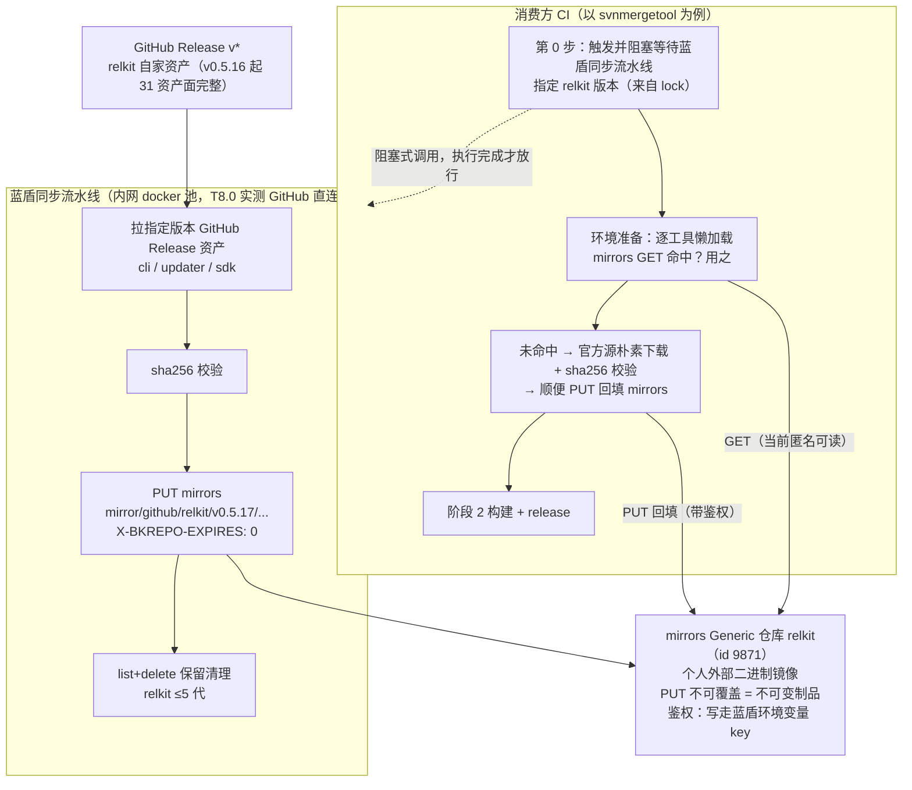

# ADR 0018: 构建环境工具链分发——generic mirror 懒加载 + 消费方驱动的 relkit 同步流水线

- 状态：Accepted（2026-10-04 用户批准，T8 轨当日启动；同日六修重构生产与消费模式，本文档为六修现行版；同日七修补两项定案：人工兜底通道须显式提示、mirrors 写鉴权凭据名 `generic_mirror`）
- 日期：2026-10-04
- 修订史：一修——按 ci-env 分支实测数据修正体积与 LFS 增量模型；二修——bundle 改裸文件树 + manifest（拆包）；三修——内网分支弃 LFS 改普通 blob 直存；四修——（全部作废，见五修）；五修（2026-10-04 用户裁决，存储与分发整体换血）：弃 git 仓库当文件服务器的全部方案，内网存储换 mirrors Generic 仓库，蓝盾下载流水线拉 Release 上传，消费端阶段 1 改 HTTP 下载；六修（2026-10-04 用户裁决，生产与消费模式整体重构，五修的 pack 子流程当日落地当日作废）：①硬事实——GitHub Actions 永远无法触发内网蓝盾流水线，不做验证；蓝盾手动触发不作为正常流程（"顺便触发"不可靠）。②relkit 资产同步改消费方驱动：消费方 CI 第 0 步阻塞式触发蓝盾同步流水线并指定 relkit 版本，同步执行完成才允许进行下一步；同步流水线消费的是 GitHub Release（非任何 pack 产物），Release 里缺东西就补 release.yml。③工具链准备弃"一套大的环境 zip"，改依托 generic mirror 的懒加载回填：消费端先向 mirrors 要；要不到就走最简单朴素的官方源下载（与外网构建同思路，不做复杂化）；下载到后顺便 PUT 回填 mirrors，下次 CI 即命中；官方源也不通则要求开发者自行准备并上传 mirrors。④mirrors Generic 仓库定位为个人外部二进制镜像（relkit CLI + 各工具链分发物），读写鉴权，key 由用户配置进蓝盾环境变量。⑤pack 打包子流程与分层 bundle 方案整体作废：pack-ci-env.yml 与 scripts/pack/ 已删除、相关两提交（e1ad317 / 47e4dcf）已回滚、ci-env-latest Release（含 2GB 工具链资产）已删除，relkit 仓回归只产 relkit 自家资产。七修（2026-10-04 用户补充裁决，六修之上的两点细化）：①官方源不可达触发的人工兜底通道必须显式提示——CI 失败输出须包含机器可识别标记与人类可读指引（目标镜像路径、鉴权凭据名 `generic_mirror`、上传方法），方便 agent 与人类 alike 直接识别处置；②mirrors 写鉴权凭据已建于蓝盾凭据管理：凭据名 `generic_mirror`，类型 USERNAME_PASSWORD，yaml 引用 `${{ settings.generic_mirror.username }}` / `${{ settings.generic_mirror.password }}`（iWiki 4014328242 定义），basic auth 直用，不落 yaml 明文与仓库文件。
- 修订：[ADR 0017](0017-cli-owns-consume-source-channel.md) 配套落地的 ci-env 环境包架构的替代方案。本 ADR 不改 0017 的消费通道与信任根决策；六修后环境准备机制从"预打包 bundle 物化"换为"mirror 缓存 + 懒加载回填"，ci-env 孤儿分支机制整体退役。
- 关联：[ADR 0017](0017-cli-owns-consume-source-channel.md)；任务分解见 [2026-10-04 CI 发布链路修复计划](../_pending/2026-10-04-ci-release-stability-plan.md) 第 8 节（T8）

## 背景

ci-env 孤儿分支机制（2026-10-01 随 ADR 0017 落地）将构建的全部网络输入预打包为 sha256 钉定的 bundle：阶段 1 单 git clone + 校验物化，阶段 2 全程离线。它根治了内网构建机的环境类失败（TLS 中间人拦截、坏代理、模块缓存中毒），10-02 三批 15 连发全绿实证有效。但机制存在三个残留缺陷，共同根因是打包动作在开发者本机手工执行：

1. 跨平台不可持续。bundle 仅覆盖 windows-amd64：Loom `ci_prepare_env.ps1` 钉死 `$Target = "windows-amd64"`；SvnMergeTool `ci_prepare_env.py` 对非 Windows 主机直接跳过（"ci-env 环境包仅覆盖 windows-amd64"）。而 SvnMergeTool 的发布矩阵含 mac 平台（2026-10-04 用户确认），其 mac 构建机只能走 goproxy 网络自举——无离线保障、无 sha 钉定，机制对 mac 发布面不充分。
2. 打包半衰期。打包知识只在重打包时刻被检验：构建 +60（rust 包漏打 cargo-home/bin/ 下 14 个 rustup 垫片）、+61（junction 顺序倒挂，重建 npm 链接时 bindings 目录尚未物化）均为"上一次打包时的知识盲区"，随打包间隔积累、下次重打包集中爆发。
3. 重打包成本。relkit 每前进一版，loom/launcher 需各手工重打全量 bundle（2026-10-04 实测当前 ci-env 分支：15 文件共约 750 MB——rust-toolchain 510 + npm-deps 146 + node 41 + relkit 层约 22 + 其余零头），慢、易错、随 re-pin 频率线性增长；且本机组装的 zip（rust-toolchain / npm-deps）即使内容不变、重打后字节也不同（归档时间戳与顺序所致），每次全量重打都在服务端对象库留下数百 MB 新对象（LFS 时代且永不回收——该问题链经多轮修订，最终随五修的 mirrors 存储方案整体消失，见决策 9）。

2026-10-04 用户拍板方向：保留内网离线机制；打包动作进 relkit 发布链——正常发布完成后并行起一个不阻塞主发布的子流程，在不同平台 runner 上打离线包，开发者零参与。

2026-10-04 用户二次裁决（同日）：分层通过（toolchain 低频 / relkit 层高频）；设计意图确认为单分支只存最新版、不留任何历史（实测 ci-env 即单提交孤儿分支、克隆只拉当前提交对象，与该意图一致）；LFS 增量问题的根因澄清为服务端对象生命周期而非分支历史（该问题链后随五修的 mirrors 存储方案整体消失，见决策 9）。

同日用户另两项裁决：bundle 拆包为裸文件树 + manifest 清单（动机：git blob 内容寻址——文件未变 blob 不变、push 零传输，假增量结构上消失，物化端解压环节整体删除）；内网分支弃 LFS 改普通 blob 直存（动机：旧代对象从"LFS 服务端永不回收"变为"git GC 可回收"，膨胀根源消除）。

2026-10-04 用户最终裁决（同日，存储与分发整体换血，前两项随之作废）：git 仓库当文件服务器的全部方案废弃——GitHub 侧离线环境文件只进 Release 构建产物、不进任何仓库分支；内网存储位改为腾讯软件源 mirrors Generic 仓库（mirrors.tencent.com，研发管理部运营，bk-repo + 内网 COS 底层，99.9% SLA）。`relkit` 公开仓库当日创建（repo id 9871，owner firoyang）并端到端实证：建仓 API / PUT 上传 / X-Checksum-Sha256 校验头 / 公开匿名下载 / list / DELETE 全通，已存在文件 PUT 不可覆盖（不可变制品保护）。内网侧由新增蓝盾下载流水线从 GitHub Release 拉资产上传 mirrors 版本化路径；消费端构建机阶段 1 改 HTTP 下载（win/mac/linux 同构）。git 内容寻址动机消失后，bundle 形态回归分层 zip + manifest，解压物化环节回归是本方案唯一真实回退。

2026-10-04 用户六修裁决（同日第三轮，生产与消费模式整体重构；五修方案当日上午刚落地、同日被实测推翻执行）：五修的 pack 子流程两轮实跑暴露定位错误——relkit GitHub 仓的职责是产出 relkit 自家二进制，替全舰队打包 2GB 工具链 zip 挂自己的 Release 是越位。用户裁决：①GitHub Actions 无法触发内网蓝盾流水线是硬事实，不做验证、不做桥接尝试；②蓝盾手动触发不可靠（"顺便触发"），正常流程从消费方考虑——消费方 CI 第 0 步即阻塞式调用蓝盾同步流水线、指定所需 relkit 版本，流水线执行完成才放行后续 step，同步完全集中在同步流水线里；③同步流水线消费 GitHub Release 本身，Release 缺资产则补 release.yml，不消费任何 pack 产物；④工具链准备弃大环境 zip，改 generic mirror 懒加载回填：消费端先向 mirrors 请求（GET 命中即用），未命中走最简单朴素的官方源下载（与外网构建同一思路，不复杂化），下载成功后顺便 PUT 回填 mirrors（下次 CI 直接命中），官方源不可达则开发者自行准备并上传 mirrors（人工兜底通道）；⑤mirrors Generic 仓库读写需鉴权，key 由用户配置进蓝盾环境变量，不经其他渠道。六修落地现场：pack 三件套已删（.github/workflows/pack-ci-env.yml、scripts/pack/pack_ci_env.py、scripts/pack/toolchain-versions.json）、两提交回滚（e1ad317 / 47e4dcf，master 回到 a01aa85）、ci-env-latest Release 删除、仓库默认分支已修正为 master（pack 实跑期间发现 main 陈旧停滞 v0.5.5 时代而发布线全在 master——该修正独立于六修、属仓库卫生，保留）。

## 决策

1. relkit 资产同步为消费方驱动的蓝盾同步流水线（bkci 新 yaml，T8.1 落地）：消费方 CI 的第 0 步（环境准备之前）以阻塞方式调用蓝盾同步流水线并指定所需 relkit 版本（如 `--version v0.5.17`），流水线执行完成（成功或明确失败）后才允许进入下一步；同步完全集中在这条流水线里，不做"tag 后顺便触发"、不做 GitHub Actions → 蓝盾的任何触发尝试（该方向为硬不可行，无需验证）。流水线的消费面是 GitHub Release（v* tag 的 relkit 资产），不消费任何 pack 打包产物；Release 中缺所需资产则修 release.yml 补齐（当前 v0.5.16 资产面已完整：五平台 CLI/updater + SDK 全家桶 31 资产）。
2. 蓝盾同步流水线职责（内网 docker 池执行，T8.0 已实测 GitHub 直连绿）：拉指定版本 GitHub Release 资产（cli/updater/sdk）→ sha256 校验 → PUT 上传 mirrors 版本化路径（`mirror/github/relkit/<version>/...`，basic auth 鉴权，X-BKREPO-EXPIRES: 0 永久）→ list+delete 保留清理（relkit 留最近 5 代，对齐 retainVersions=5 先例）。非 CI 环节清零；yaml 只做 step 编排（冻结铁律），逻辑全在项目脚本。
3. 工具链准备为 generic mirror 懒加载回填模式（替代原"一套大的环境 zip"）：
   - 消费端环境准备步骤按钉定版本（toolchain.json 或等价清单）先向 mirrors 请求：`GET mirror/<tool>/<version>/...`，命中即用（内网下载快）；
   - 未命中则走最简单朴素的官方源下载（nodejs.org / python.org / static.rust-lang.org / storage.googleapis.com / proxy.golang.org，与外网构建完全同一思路），不做任何复杂化；下载到的文件 sha256 校验后使用；
   - 下载成功后顺便 PUT 回填 mirrors 同路径（带鉴权 key，从蓝盾环境变量取），下一次 CI 或其他消费方即直接命中；
   - 官方源也不可达（构建机网络故障）时：这是开发者必须人工介入的信号，由开发者自行准备文件并上传 mirrors（人工兜底通道），CI 不重试、不绕路。**人工兜底须显式提示（七修定案）**：CI 置红的输出必须同时包含 ①机器可识别标记（`[MANUAL-UPLOAD-REQUIRED]`，供 agent/监控抓取）与 ②人类可读指引块——缺失的目标镜像 URL（`https://mirrors.tencent.com/repository/generic/relkit/mirror/<tool>/<version>/<file>`）、文件 sha256 预期值（来自 toolchain.json 钉定）、上传命令样例（basic auth，凭据走蓝盾 `generic_mirror` 或开发者个人 token）、上传后重跑 CI 的提示。该指引块格式固定，任何懒加载失败置红处（同步流水线与消费端 ci_prepare_env）均须输出。
   该模式的好处：无需预打包任何大 zip；首次执行慢、后续命中即快；镜像内容随实际使用自然生长，无用版本不占存储。
4. mirrors Generic 仓库定位为个人外部二进制镜像（repo `relkit`，repo id 9871）：不限于 relkit CLI，一切"内网慢/不可达的外部二进制分发物"皆可镜像（relkit CLI、flutter SDK、go toolchain、python、node 等）。读写均需鉴权：读（GET）当前实测公开匿名可读，写（PUT/DELETE）需 basic auth，key 由用户配置进蓝盾环境变量（凭据管理），不落 yaml、仓库与文档。**凭据已建（七修定案）**：蓝盾凭据名 `generic_mirror`，类型 USERNAME_PASSWORD；bkci yaml 中引用 `${{ settings.generic_mirror.username }}` / `${{ settings.generic_mirror.password }}`（蓝盾官方表达式，iWiki 4014328242），注入项目脚本环境变量后由脚本组装 basic auth。路径分区按来源组织：`mirror/github/relkit/<version>/...`（GitHub Release 资产）、`mirror/flutter/<version>/...`、`mirror/golang/<version>/...` 等官方源镜像区。
5. 消费端改造（T8.2，原 T8.4）：各产品仓 `ci_prepare_env` 脚本从"ci-env 孤儿分支 clone + sha 校验物化"改为：
   - relkit 层：CI 第 0 步先跑同步流水线（决策 1），随后从 mirrors GET 对应版本资产（命中有保障——同步流水线刚上传完）；
   - 工具链层：决策 3 懒加载回填模式（mirrors GET → 官方源下载 → 回填 PUT → 开发者兜底）；
   - 原 ci-env 孤儿分支、.gitattributes LFS 追踪、manifest loom-env/1 schema、`git clone --branch ci-env` 物化链全部退役；loom-env/2 schema 不再需要（无预打包 bundle 即无 bundle manifest），各工具的 sha256 钉定挪进各仓 toolchain.json 或等价清单（现状已有该文件，SvnMergeTool 与 launcher 均在用）。
6. mac 覆盖面（T8.0 实测定案不变）：单 darwin-arm64 面（蓝盾 mac 池为 Apple Silicon aarch64，RelkitEnvProbe 构建 #1 实测 `os.arch: aarch64`），relkit 资产取 Release 的 darwin-arm64 CLI（sha256 `df1d942e483adeef776a233acc5860d75f22625c8e1ecec4fbf0bd25daaa009b`）；darwin-amd64 资产保留在 Release 供非蓝盾 x64 mac 消费方；flutter engine artifacts 由消费端 `flutter precache --macos` 按需生成（懒加载模式下 SDK 自带预烘焙 cache + precache 补充，无需打包时预烘焙）；xcode 等池预置依赖不进 mirror、显式记录为残余依赖。
7. linux 汇总容器（tlinux3_ci）不入离线通道：维持内网 goproxy 现状（2026-10-04 用户确认，五修定案延续）。
8. 成本：relkit 仓公开（ADR 0017 硬前提）不变；成本仅剩 mirrors 存储占用（随懒加载自然生长，无预打包全量）与蓝盾同步流水线一次性搭建；macos runner 免费（public 仓）——但六修后 relkit 仓 CI 不再跑任何工具链打包，mac runner 成本项消失。
9. 配套耦合显式化：同步流水线阻塞式注入后，产品仓 lock 漂移直接可见（lock 要求版本在 mirrors 缺失 → 第 0 步即红），与舰队统一钉定（T1）、`lock bump` 子命令（T2 顺手项）天然配套。原决策 11 的"relkit 层随 tag 自动前进"语义由"消费方按 lock 指定版本触发同步"替代——前进不再依赖 tag 推送事件，依赖消费方声明。

## 流程总览

## 结果

- 正面：消费方驱动的同步让"lock 指定的版本缺什么"在第 0 步暴露（不再有 tag 事件依赖）；工具链懒加载回填让环境准备无需任何预打包动作，镜像内容随实际使用自然生长；非 CI 环节清零（开发者只在官方源不可达时介入）；relkit 仓回归纯自家资产生产，不再替舰队打包工具链；原分层 bundle 的 sha256 钉定纪律保留在 toolchain.json 等价清单中。
- 代价与已知事实：环境准备从"bundle 命中"变为"逐工具 GET/下载"，首次冷启动慢（无 mirror 命中时走官方源，T8.0 实测三池对官方源连通性：mac 绿 / docker 绿 / win 存在企业根证书链缺失——win 池官方源 TLS 失败时走开发者兜底通道）；+60 类"本机有、包里没有"盲区消失形态变化（懒加载下每工具首次拉取都是真实下载，sha 钉定在 toolchain.json 校验）；回填 PUT 需要消费端持有写鉴权 key（蓝盾环境变量注入）。
- 回退：停用同步流水线 + 消费端 revert ci_prepare_env 改造，回到 ci-env 孤儿分支手工打包现状（git 历史、LFS 机制未被破坏，可完整恢复）。

## 开放问题（1、3、4 已定案，2 待拍板）

1. 【已定案 2026-10-04，同日经 T8.0 实测修正】darwin 覆盖面：单 darwin-arm64 包。T8.0 静态盘点原判蓝盾 mac 湖为 Intel x64（池规格 macos-macOS15.6 / Macmini-5 / xcode 26.3，构建日志实锤 darwin-x64 engine artifacts 7 项下载），同日 RelkitEnvProbe 构建 #1 job 日志 Machine Environment Properties 实锤 `os.arch: aarch64`（Apple Silicon），推翻原判：池实际为 ARM64 Macmini（darwin-x64 engine 下载为 Rosetta/x64 仿真面兼容项，非池架构证据）；darwin 资产改为直引 Release 的 darwin-arm64 CLI（v0.5.15 起已存在，sha256 `df1d942e483adeef776a233acc5860d75f22625c8e1ecec4fbf0bd25daaa009b`），darwin-amd64 资产保留在 Release 供非蓝盾 x64 mac 消费方。六修后 flutter engine artifacts 由消费端 `flutter precache --macos` 按需生成（官方 SDK zip 自带预烘焙 cache 基础上补充 darwin 面）；xcode 26.3 池预置不进 mirror、显式记录为残余依赖。附带实证：mac job 现状网络面为 goproxy（mirrors.tencent.com/go/）+ storage.googleapis.com（Flutter engine）+ pub.dev + CocoaPods CDN 四条公网直连。
2. deps 层产物形态（六修后待重议）：五修的"deps 层 zip"概念随 bundle 整体作废；懒加载模式下，产品特有依赖（npm node_modules / pub cache 等）是否需要镜像区（如 `mirror/npm/<product>/<version>/...`）取决于实测拉取速度，随 T8.2 消费端改造时按需定；若 pub/npm 内网源已够快则不做。
3. 【已定案 2026-10-04，RelkitEnvProbe 构建 #1 实测】蓝盾构建机连通性三池全测完毕（探测脚本 SvnMergeTool e0b6215 + 流水线 bkci 3935989，探测对象 v0.5.15 Release CLI 资产 + mirrors probe 对象 960071 字节）：①linux 容器（tlinux3_ci:1.5.1，python 3.6.8）：GitHub 直连 PASS（4.3s，11.1MB sha256 校验过）+ mirrors 匿名 GET PASS（302→内网 IP，0.1s）——同步流水线执行池，主链路门关闭；②macos（Macmini-5，python 3.11.12/OpenSSL 3.5.2）：GitHub 直连 PASS（2. Rel2.8s）+ mirrors 匿名 GET PASS（302→COS 内网域名 HTTPS，证书校验通过，0.3s）；③windows（windows-2016，python 3.10.7/OpenSSL 1.1.1q）：GitHub FAIL（企业根证书链缺失，`SSLCertVerificationError: unable to get local issuer certificate`，默认与 no-proxy 双变体均败）+ mirrors 匿名 GET PASS（302→内网 IP，0.3s）——win 证书问题不阻塞主链路（win 消费端工具链层走 mirrors 命中或开发者兜底），记为已知事实；④三池 proxy env 全空（urllib.getproxies() 空），COS 302 域名 no_proxy 坑当前无暴露面；⑤构建机 Python 版本差异实测确认（3.6.8/3.10.7/3.11.12），探测脚本纯标准库设计三平台全过。
4. 【已定案 2026-10-04】linux 汇总容器（tlinux3_ci）不入离线通道：维持内网 goproxy 现状（用户确认）。
5. 【六修新增待定】mirrors 仓库命名：repo 名 `relkit`（id 9871）与"个人外部二进制镜像"的实际定位不符，但仓库已建好且 PUT/GET/DELETE 全链验证过——是否改名（或加前缀路径分区）由用户拍板；本 ADR 按保留 repo 名 + 路径分区（`mirror/<source>/<tool>/<version>/...`）编写。
6. 【六修新增待定】同步流水线触发后失败（GitHub Release 拉取失败 / mirrors PUT 失败）时消费方 CI 的行为：本 ADR 默认失败即红（同步不成功不进入构建），不做静默降级；是否需要更细粒度的超时/重试策略随 T8.1 落地实测定。
