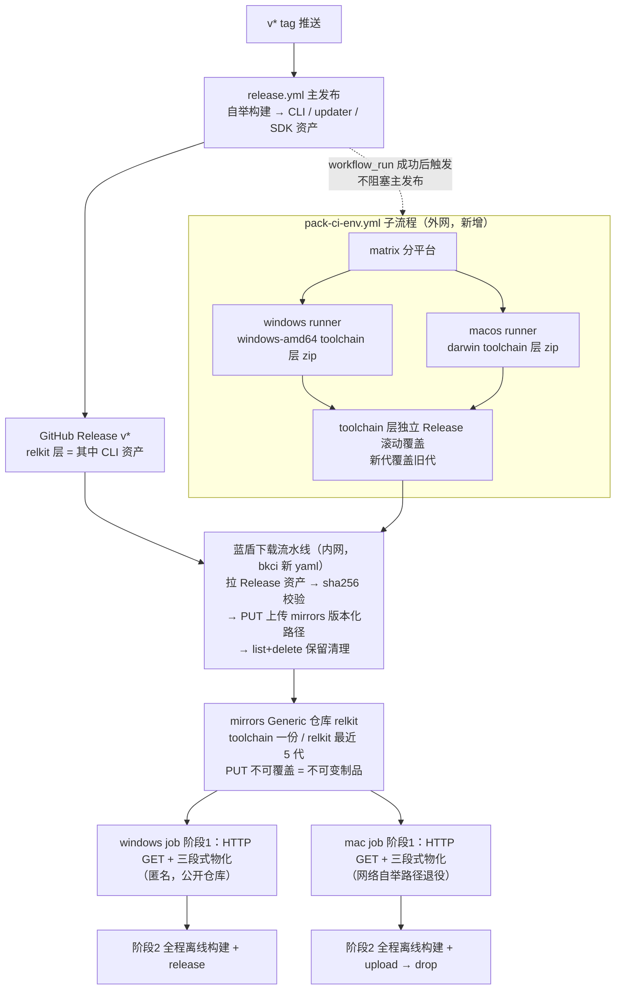

# ADR 0018: 离线环境包打包进 relkit 发布链（多平台子流程，内网存储走 mirrors）

- 状态：Accepted（2026-10-04 用户批准，T8 轨当日启动）
- 日期：2026-10-04
- 修订史：一修——按 ci-env 分支实测数据修正体积与 LFS 增量模型；二修——bundle 改裸文件树 + manifest（拆包）；三修——内网分支弃 LFS 改普通 blob 直存；四修——（全部作废，见五修）；五修（2026-10-04 用户裁决，存储与分发整体换血）：弃 git 仓库当文件服务器的全部方案（LFS、blob 直存均不再用），离线环境包在 GitHub 侧只进 Release 构建产物、不进任何仓库分支；内网存储位改为腾讯软件源 mirrors Generic 仓库（`relkit` repo，2026-10-04 已创建并端到端验证：repo 创建 / PUT 上传 / sha256 校验头 / 公开匿名下载 / DELETE 全通）；内网侧由新增蓝盾下载流水线从 GitHub Release 拉资产上传 mirrors，消费端构建机阶段 1 改 HTTP 下载。原决策 2/4/5/9 中所有 git 分支直存、LFS、摆渡器 force push、工蜂 blob 实测可行性门内容全部作废；schema 仍一刀切 loom-env/2。任务分解见任务文档第 8 节（T8，已同步重写）；批准——2026-10-04 用户确认开放问题 4 解释后指示"继续推进"，ADR 转 Accepted、T8 轨当日启动，开放问题 1（darwin 覆盖面：单 darwin-amd64 包）与 4（linux 容器维持不动）同日定案
- 修订：[ADR 0017](0017-cli-owns-consume-source-channel.md) 配套落地的 ci-env 环境包架构。本 ADR 不改 0017 的消费通道与信任根决策，只改环境包的生产方式、存储位与分发链：打包执行点从开发者本机迁至 relkit 发布链下游子流程；内网存储从各产品仓 ci-env 孤儿分支迁至 mirrors Generic 仓库；manifest schema loom-env/1 → loom-env/2（增 platform 与 layer 两维）。
- 关联：[ADR 0017](0017-cli-owns-consume-source-channel.md)；任务分解见 [2026-10-04 CI 发布链路修复计划](../_pending/2026-10-04-ci-release-stability-plan.md) 第 8 节（T8）

## 背景

ci-env 孤儿分支机制（2026-10-01 随 ADR 0017 落地）将构建的全部网络输入预打包为 sha256 钉定的 bundle：阶段 1 单 git clone + 校验物化，阶段 2 全程离线。它根治了内网构建机的环境类失败（TLS 中间人拦截、坏代理、模块缓存中毒），10-02 三批 15 连发全绿实证有效。但机制存在三个残留缺陷，共同根因是打包动作在开发者本机手工执行：

1. 跨平台不可持续。bundle 仅覆盖 windows-amd64：Loom `ci_prepare_env.ps1` 钉死 `$Target = "windows-amd64"`；SvnMergeTool `ci_prepare_env.py` 对非 Windows 主机直接跳过（"ci-env 环境包仅覆盖 windows-amd64"）。而 SvnMergeTool 的发布矩阵含 mac 平台（2026-10-04 用户确认），其 mac 构建机只能走 goproxy 网络自举——无离线保障、无 sha 钉定，机制对 mac 发布面不充分。
2. 打包半衰期。打包知识只在重打包时刻被检验：构建 +60（rust 包漏打 cargo-home/bin/ 下 14 个 rustup 垫片）、+61（junction 顺序倒挂，重建 npm 链接时 bindings 目录尚未物化）均为"上一次打包时的知识盲区"，随打包间隔积累、下次重打包集中爆发。
3. 重打包成本。relkit 每前进一版，loom/launcher 需各手工重打全量 bundle（2026-10-04 实测当前 ci-env 分支：15 文件共约 750 MB——rust-toolchain 510 + npm-deps 146 + node 41 + relkit 层约 22 + 其余零头），慢、易错、随 re-pin 频率线性增长；且本机组装的 zip（rust-toolchain / npm-deps）即使内容不变、重打后字节也不同（归档时间戳与顺序所致），每次全量重打都在服务端对象库留下数百 MB 新对象（LFS 时代且永不回收——该问题链经多轮修订，最终随五修的 mirrors 存储方案整体消失，见决策 9）。

2026-10-04 用户拍板方向：保留内网离线机制；打包动作进 relkit 发布链——正常发布完成后并行起一个不阻塞主发布的子流程，在不同平台 runner 上打离线包，开发者零参与。

2026-10-04 用户二次裁决（同日）：分层通过（toolchain 低频 / relkit 层高频）；设计意图确认为单分支只存最新版、不留任何历史（实测 ci-env 即单提交孤儿分支、克隆只拉当前提交对象，与该意图一致）；LFS 增量问题的根因澄清为服务端对象生命周期而非分支历史（该问题链后随五修的 mirrors 存储方案整体消失，见决策 9）。

同日用户另两项裁决：bundle 拆包为裸文件树 + manifest 清单（动机：git blob 内容寻址——文件未变 blob 不变、push 零传输，假增量结构上消失，物化端解压环节整体删除）；内网分支弃 LFS 改普通 blob 直存（动机：旧代对象从"LFS 服务端永不回收"变为"git GC 可回收"，膨胀根源消除）。

2026-10-04 用户最终裁决（同日，存储与分发整体换血，前两项随之作废）：git 仓库当文件服务器的全部方案废弃——GitHub 侧离线环境文件只进 Release 构建产物、不进任何仓库分支；内网存储位改为腾讯软件源 mirrors Generic 仓库（mirrors.tencent.com，研发管理部运营，bk-repo + 内网 COS 底层，99.9% SLA）。`relkit` 公开仓库当日创建（repo id 9871，owner firoyang）并端到端实证：建仓 API / PUT 上传 / X-Checksum-Sha256 校验头 / 公开匿名下载 / list / DELETE 全通，已存在文件 PUT 不可覆盖（不可变制品保护）。内网侧由新增蓝盾下载流水线从 GitHub Release 拉资产上传 mirrors 版本化路径；消费端构建机阶段 1 改 HTTP 下载（win/mac/linux 同构）。git 内容寻址动机消失后，bundle 形态回归分层 zip + manifest，解压物化环节回归是本方案唯一真实回退。

## 决策

1. 新增打包子流程 `.github/workflows/pack-ci-env.yml`，由 release.yml 完成且结论为 success 时经 `workflow_run` 触发（workflow 须存在于默认分支，匹配名以 release.yml 实际 name 字段为准）。matrix 分平台：windows runner 产 windows-amd64 toolchain 层，macos runner 产 darwin toolchain 层。主发布零影响：子流程失败只意味着 bundle 不前进，内网继续用旧包，故障不外溢。另配 `workflow_dispatch` 与可选月度 `schedule` 支持 toolchain 层低频重打。
2. bundle 存储形态：分层 zip + manifest（五修回归）。原拆包方案（裸文件树 + manifest）的动机是 git blob 内容寻址（文件未变 → blob sha 未变 → push 零传输）；五修弃 git 分支存储后该动机消失，重组 zip 不再付出假增量代价——mirrors 版本化路径 + PUT 不可覆盖意味着新内容必落新路径，无需追求同路径字节稳定，本机重打 zip 的字节漂移（归档时间戳与顺序）不再是问题。形态与约束：
   - 每层一个 zip：toolchain 层按平台（windows-amd64 / darwin）、deps 层按产品、relkit 层聚合该 tag 的 CLI/updater/SDK 资产；manifest.json 记录层 zip 整体 sha256 与逐文件 path / sha256 / size / mode（mode 补 unix 可执行位，darwin 侧必需，zip 归档不保证，物化端按 manifest 恢复）；
   - 物化端三段式：zip 整体 sha 校验 → 确定性顺序解压 → 逐文件 sha 校验，坏可定位到文件级；
   - 代价（本方案相对拆包方案的唯一真实回退）：解压物化环节回归，"+61 类 junction 顺序倒挂"故障面重新存在，由物化脚本确定性顺序 + 逐文件校验压制；原"万级小文件 clone 时间 / core.longpaths"代价随 git 存储作废消失。
   打包纯度铁律不变：打包脚本在干净 runner 上从零下载钉定版本的工具链（nodejs.org / python.org / static.rust-lang.org / flutter 官方源，版本清单单一源进本仓）；禁用 runner 预装工具、actions/setup-* 与 actions/cache 注入；产物全 sha256 钉定。+60 类"本机有、包里没有"的盲区由纯度铁律排除（干净 runner 从零下载，本机状态不进包），漏项打包 CI 直接红。
3. manifest loom-env/1 → loom-env/2：增 platform 与 layer 两维，三层分职：
   - toolchain 层（node/python/rust+registry/rustup-init/nsis 等；mac 侧 darwin 基线经 T8.0 实测定案（2026-10-04，修正过程见开放问题 1）：单 darwin-arm64 包，蓝盾 mac 池为 Apple Silicon aarch64；flutter 等仅部分产品所需的内容可作独立子层，避免无关产品拉取）：pack 子流程生产，低频重打、不随 tag 重传；
   - deps 层（产品特有依赖预物化：npm node_modules / pub cache 等）：生产点与刷新节奏见开放问题 2；
   - relkit 层（该 tag 预编译 CLI 制品 + lock 元数据，实测约 22 MB：cli 11.4 + updater 10.4 + sdk/host-scripts zip 0.3）：不重新打包，直接引用对应 v* Release 资产（windows-amd64 已存在；darwin 资产若缺则 release.yml 补 target），随 tag 高频前进；每次 tag 的新增上传即此约 22 MB（relkit 层新代路径），其余层未变不重传（路径与内容不变，消费端按 lock 直取旧路径）。
   消费端 ci_prepare_env 按 platform 选层、按层独立 sha 校验与物化。分层消除"每次 tag 重传全量"。
4. 产物发布形态（GitHub 侧）：toolchain 层挂独立 GitHub Release 且滚动覆盖（新代资产上传后删除旧代资产——执行"只存最新版、不留历史"原则；下载端以 manifest 中的代号为快照键，防止读到半新半旧）；relkit 层即 v* Release 本身（Release 面按定义保留历史——lock 钉旧版依赖旧 Release 存在，不受"只存最新版"约束）；全部 sha256 进 loom-env/2 manifest。GitHub 侧离线文件只以 Release 资产形态存在、不进任何仓库分支（普通分支单文件 100 MB 硬限制，rust librustc_driver 约 150-190 MB 超限）；内网存储位为 mirrors Generic 仓库（决策 5），原"内网 ci-env 分支 blob 直存"边界整体作废。
5. 内网存储与分发：蓝盾下载流水线（内网 bkci 新 yaml，挂靠蓝盾项目随 T8.3 落定）从 GitHub Release 拉层产物 → sha256 校验 → PUT 上传 mirrors Generic 仓库版本化路径（`https://mirrors.tencent.com/repository/generic/relkit/<layer>/<version>/...`，basic auth 鉴权，X-BKREPO-EXPIRES: 0 永久）。要点：
   - 版本化路径天然原子：新版本 = 新路径，不存在"写到一半被读到"的中间态，staging/原子 rename 机制全部不需要；
   - PUT 不可覆盖 = 不可变制品保护（实测已存在文件 PUT 被拒），防误传防漂移；
   - 非 CI 环节清零：原摆渡同步器方案（内外网双通机器 + local_scheduler + force push 孤儿分支）作废，全链每一跳都是 CI；
   - 连通性：蓝盾→mirrors 已有三池 T8.0 实测绿（win/mac/linux 消费端池全部匿名 GET 成功）；蓝盾→GitHub 已于 T8.0 实测（2026-10-04，RelkitEnvProbe 构建 #1）：docker 池（tlinux3_ci，下载流水线执行池）直连 GitHub Release 下载 + sha256 校验全绿（4.3s / 11.1MB），连通性门关闭；win 池 GitHub 侧存在企业根证书链缺失（python urllib SSLCertVerificationError，默认与 no-proxy 双变体均败），不阻塞本 ADR 主链路（win 消费端阶段 1 走 mirrors，实测绿；GitHub 直下只发生在 T8.3 docker 池）；mac 池 GitHub 直连绿（2.8s）；
   - PAC/bkci yaml 铁律适用：yaml 只做 step 编排，下载/校验/上传/清理逻辑全部封装项目脚本，yaml 一次成型后冻结。
6. 消费端多平台化：Loom/launcher `ci_prepare_env.ps1` 的 `$Target` 参数化，物化逻辑改 HTTP 下载（curl -L 拉 mirrors URL）+ 三段式校验物化；SvnMergeTool `ci_prepare_env.py` 删除"非 Windows 跳过"分支，mac job 阶段 1 改走同构 HTTP 物化、阶段 2 全离线。linux 汇总容器（tlinux3_ci）维持内网 goproxy 现状（开放问题 4）。
7. mac bundle 边界：xcode 等系统级依赖不进包（蓝盾 mac 池预置，残余依赖显式记录于 manifest）；go/python/node/rust/flutter/relkit 等用户态工具链全进。动手前必须完成 T8.0 盘点——mac job 现状网络自举的实际拉取清单即 mac bundle 内容基线。
8. schema /2 一刀切，不留 /1 兼容（沿用 manifest /1 → /2 与 v0.5.8 删兼容分支的先例）：生产端与全部消费端同窗切换，不保留双 schema 解析；回退即整体回退。
9. 对象生命周期（五修后按 mirrors 重写；git 分支存储的对象生命周期问题——LFS 永不回收、blob GC、force push 未引用对象——随方案作废整体消失，工蜂 blob 限制实测门作废）：
   - 版本化路径 + 不可变制品：新内容必落新路径（toolchain/<代>/、relkit/<版本>/），mirrors PUT 对已存在文件拒绝覆盖（实测），从根上杜绝对象漂移；未变层不重传；
   - 保留策略：toolchain 层严格一份（新代上传并验证后由流水线删除旧代路径，当前量级约 570 MB）；relkit 层留最近 5 代（约 22 MB/代，对齐外网 Release retainVersions=5 先例）；deps 层节奏随开放问题 2 定，默认同 relkit 层；
   - 清理机制：流水线内置 list + delete 脚本（两 API 均已实测可用），无 LFS 清理入口、无 git GC 依赖、无服务端治理项。
10. 成本：relkit 仓公开是 ADR 0017 的硬前提，macos runner 对 public 仓免费，无计费压力；真实成本仅剩 mirrors 存储占用（决策 9 量级：toolchain 一份约 570 MB + relkit 五代约 110 MB，deps 层见开放问题 2）与蓝盾下载流水线的一次性搭建（bkci yaml + 项目脚本）。
11. 配套耦合显式化：relkit 层随 tag 自动前进后，产品仓 lock 漂移直接可见（bundle 新、lock 旧的状态会暴露），与舰队统一钉定（T1）、`lock bump` 子命令（T2 顺手项）天然配套，建议同窗推进。本 ADR 落地后，全舰队 re-pin 不再包含手工全量重打包步骤。

## 流程总览

## 结果

- 正面：跨平台打包开发者零参与；打包知识检验周期从"打包间隔"缩至"每次 tag"；SvnMergeTool mac 构建获得与 windows 对等的离线保障；每次 tag 新增上传收敛为 relkit 层约 22 MB（其余层未变不重传）；非 CI 环节清零（摆渡器 → 蓝盾流水线，全链每跳都是 CI）；版本化路径原子性 + PUT 不可覆盖的不可变制品保护（ssh/rsync/staging/原子 rename 机制全部消失）；LFS/smudge/.gitattributes/core.longpaths/git clone 全链退役；win/mac/linux 消费端同构（同一 HTTP 下载 + 校验 + 物化形态）。
- 代价与新增维护面：解压物化环节回归（拆包方案曾删除，本方案唯一真实回退；+61 类顺序故障面由物化脚本确定性顺序 + 逐文件校验压制）；蓝盾→GitHub 连通性门已于 T8.0 实测关闭（docker 池全绿；win 池企业根证书链缺失致 python urllib TLS 失败为已知事实，不进主链路——win 消费端走 mirrors 实测绿）；COS 302 重定向域名的代理 no_proxy 配置（已知 413/401 坑；T8.0 实测三池 proxy env 全空、mac 池 HTTPS COS 内网域名证书校验通过，该坑当前无暴露面，消费端落地时保留 no_proxy 配置提示）；蓝盾下载流水线与打包脚本成为新维护面；mirrors 凭证管理（basic auth token 进蓝盾凭据管理，不落 yaml 与仓库）。
- 回退：/2 切换前——停用 pack-ci-env.yml + 下载流水线 + 消费端逐仓 revert；/2 切换后——整体 revert。均回到现状手工打包，各产品仓互不牵连。

## 开放问题（1、3、4 已定案，2 待拍板）

1. 【已定案 2026-10-04，同日经 T8.0 实测修正】darwin 覆盖面：单 darwin-arm64 包。T8.0 静态盘点原判蓝盾 mac 池为 Intel x64（池规格 macos-macOS15.6 / Macmini-5 / xcode 26.3，构建日志实锤 darwin-x64 engine artifacts 7 项下载），同日 RelkitEnvProbe 构建 #1 job 日志 Machine Environment Properties 实锤 `os.arch: aarch64`（Apple Silicon），推翻原判：池实际为 ARM64 Macmini（darwin-x64 engine 下载为 Rosetta/x64 仿真面兼容项，非池架构证据）；darwin 资产改为直引 Release 的 darwin-arm64 CLI（v0.5.15 起已存在，sha256 `df1d942e483adeef776a233acc5860d75f22625c8e1ecec4fbf0bd25daaa009b`），darwin-amd64 资产保留在 Release 供非蓝盾 x64 mac 消费方。darwin bundle 内容基线：Flutter SDK 3.38.3（bundle 自带，不信任池内 fvm 预置）、Flutter engine artifacts（按消费机架构随 T8.1 打包实测定 x64/arm64 面）、Go 1.26.3 toolchain（golang.org/toolchain zip）、pub 包预物化、CocoaPods 依赖、relkit 层；xcode 26.3 池预置不进包，作为残余依赖显式记录于 manifest。附带实证：mac job 现状网络面为 goproxy（mirrors.tencent.com/go/）+ storage.googleapis.com（Flutter engine）+ pub.dev + CocoaPods CDN 四条公网直连，离线化必要性成立。
2. deps 层生产点：候选 a) pack 子流程按产品 matrix 打包（需产品依赖清单外置或产品仓 checkout）；候选 b) 维持开发者本机打包、改为直接 PUT 上传 mirrors（不再经 git）；候选 c) 产品仓自身 CI 顺产上传。同时定刷新节奏与 mirrors 保留代数。
3. 【已定案 2026-10-04，RelkitEnvProbe 构建 #1 实测】蓝盾构建机连通性三池全测完毕（探测脚本 SvnMergeTool e0b6215 + 流水线 bkci 3935989，探测对象 v0.5.15 Release CLI 资产 + mirrors probe 对象 960071 字节）：①linux 容器（tlinux3_ci:1.5.1，python 3.6.8）：GitHub 直连 PASS（4.3s，11.1MB sha256 校验过）+ mirrors 匿名 GET PASS（302→内网 IP，0.1s）——T8.3 下载流水线执行池，主链路门关闭；②macos（Macmini-5，python 3.11.12/OpenSSL 3.5.2）：GitHub 直连 PASS（2.8s）+ mirrors 匿名 GET PASS（302→COS 内网域名 HTTPS，证书校验通过，0.3s）；③windows（windows-2016，python 3.10.7/OpenSSL 1.1.1q）：GitHub FAIL（企业根证书链缺失，`SSLCertVerificationError: unable to get local issuer certificate`，默认与 no-proxy 双变体均败）+ mirrors 匿名 GET PASS（302→内网 IP，0.3s）——win 证书问题不阻塞主链路（win 消费端阶段 1 走 mirrors 实测绿），记为已知事实；④三池 proxy env 全空（urllib.getproxies() 空），COS 302 域名 no_proxy 坑当前无暴露面；⑤构建机 Python 版本差异实测确认（3.6.8/3.10.7/3.11.12），探测脚本纯标准库设计三平台全过。蓝盾→mirrors 侧三池匿名 GET 全绿，连同 GOPROXY 生产先例双重验证。
4. 【已定案 2026-10-04】linux 汇总容器（tlinux3_ci）不入离线通道：维持内网 goproxy 现状（用户确认）。
