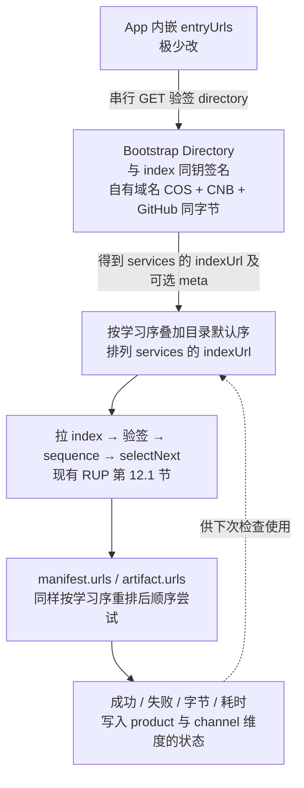

# 更新服务目录（Bootstrap Directory）设计

---
title: 更新服务目录（Bootstrap Directory）
category: design
created: 2026-08-09
updated: 2026-08-11
status: approved
related: ADR 0005, SPEC.md §1 / §4 / §12, docs/design/update-ingress-cos.md
---

## 1. 已确认目标

| # | 目标 | 验收口径 |
|---|---|---|
| G1 | **性价比优先** | 不依赖付费 Geo-DNS / Anycast / 大流量 CDN；**推荐主入口**为自有域名绑定 COS（静态对象）；单台外网 CVM 仅作可选/调试，不作默认主入口。详见 [`update-ingress-cos.md`](update-ingress-cos.md) |
| G2 | **稳定对外入口** | App 只内嵌极少变更的 `entryUrls`；机房/域名变更优先改目录，不改客户端常量 |
| G3 | **一主两备拉目录** | 顺序：**自有域名 COS（主）** → CNB raw → GitHub raw；主不可达才试备 |
| G4 | **目录即协议面** | 目录 schema 与签名规则跟项目/协议走，视为对外契约，不轻易破坏兼容 |
| G5 | **接回现有 RUP** | 拿到目录后仍走 index 验签 → manifest → artifact；不另发明自动安装通道 |
| G6 | **历史经验选源** | 用真实下载的成功/失败/吞吐排序下次尝试；**禁止**独立探测、禁止为测速浪费流量 |
| G7 | **不浪费下载** | `urls` / 多源之间**顺序**尝试；禁止并行拉同一 artifact（与 SPEC §12.3 一致） |
| G8 | **与现钥合一** | 目录用与 index/fallback **同一组** ed25519 发布钥签名；签一次、多处上传同一字节 |
| G9 | **多区域仍一份 index** | 各 serve / 镜像上的 index（及对应 manifest 对象）字节一致；多机房只体现在 `urls[]` |

## 2. 已确认风险与对策

| # | 风险 | 是否接受 / 对策 |
|---|---|---|
| R1 | 目录被劫持指向「错/坏」serve | **内容**：无私钥无法伪造可过验的 index → 装不上假包。**对策**：目录同样验签，降低「指引错路/半宕机」面 |
| R2 | 旧签名 index 重放（降级） | 已有 `lastSeenSequence` 防降级（SPEC §12.4）；目录不能削弱该规则 |
| R3 | 三处目录互不一致 | 发布必须推**同一签名字节**；客户端按 entry 串行，先拿到且验签通过者生效；可用 `directorySequence` 拒绝明显过旧目录（可选，见 §5） |
| R4 | 某一 raw 宿主被写穿 | 无钥无法伪造合法目录；该 entry 验签失败则跳过 |
| R5 | 主入口（自有域名 COS）不可达 | 备 CNB / GitHub raw 承接目录；更新流量仍走目录指向的 index / `urls[]`（可同在 COS 或其它镜像） |
| R6 | 冷启动无历史、选源次优 | **接受**；按目录 `priority` / 声明顺序试；跑过真实下载后再学习 |
| R7 | 中国/欧洲各自签「不同 URL 的 index」 | **拒绝**（违反 SPEC）；否则多源学习、双写、排错都会碎 |
| R8 | 「连通性测试」暗中耗流量 | **禁止**；只允许真实 check/download 路径记账 |
| R9 | 签名集中 = 上传单点误解 | 集中的是**持钥签名**；三处上传可并行分发同一产物 |
| R10 | 目录与 index 都旧时的可用性 | 业务上靠 publish 双写时效；客户端仍不得接受验签失败或序号倒退 |

不在本设计范围（明确不做）：

- IP 库 / 国家码猜源
- 并行竞速下载同一对象
- 为选源单独 HEAD/GET 探测
- 付费智能 DNS / Anycast 作为前提

## 3. 逻辑链路



本节只画客户端一侧。完整拓扑见 [`update-ingress-cos.md`](update-ingress-cos.md)：§4.1 发布流程（CI 只 stage、发布机持钥签名、写对象），§4.2 下载流程（与本节同链路，含 manifest / artifact 校验），§4.3 各方持有的凭据。

## 4. 与 SPEC 的对齐硬约束

1. 客户端**禁止**自行拼接下载 URL；目录里给出的必须是**绝对** `indexUrl`（及文档内已有的绝对 `urls`）。
2. 多镜像 = **同一对象多个取货点** → 全网一份 index/manifest 字节；区域差异只进 `urls[]`。
3. 签名信封与 index 相同：`ed25519`，对 payload 原始字节签名（实现期：directory payload 进 proto 或沿用 envelope 包装，见 §5）。
4. 多 URL **顺序**回退；禁止并行同一 artifact。
5. 验签失败：**禁止**降级明文使用；试下一个源。

## 5. 目录文档（草案，实现期固化到 proto/schema）

逻辑字段（示意）：

```json
{
  "schemaVersion": 1,
  "product": "svnmergetool",
  "directorySequence": 12,
  "updatedAt": "2026-08-09T12:00:00Z",
  "services": [
    {
      "id": "cn-intranet-edge",
      "priority": 10,
      "indexUrl": "https://cn.example/index/svnmergetool/stable.pb",
      "fallbackUrl": "https://cn.example/fallback/svnmergetool.pb"
    },
    {
      "id": "eu-serve",
      "priority": 20,
      "indexUrl": "https://eu.example/index/svnmergetool/stable.pb",
      "fallbackUrl": "https://eu.example/fallback/svnmergetool.pb"
    }
  ]
}
```

约定：

- `product` 必须与客户端期望一致，否则整份目录拒绝。
- `services` 内各 `indexUrl` 在成功发布后必须能下到**相同** index 字节（发布方责任）。
- `priority` 越小越优先（无学习数据时）。
- `directorySequence` 单调递增；客户端**可以**持久化 `lastSeenDirectorySequence`，拒绝明显倒退的目录（推荐，类比 index `sequence`）。
- 整份 payload 套 RUP envelope，密钥与 index 相同。

**入口 `entryUrls`：** 仅指向上述已签名目录文件的绝对 URL，不是 HTML 页。

## 6. SDK 选择与学习算法（规范性意图）

### 6.1 什么时候记账

仅在下列真实路径成功或失败时更新状态：

- 拉取 directory / index / manifest / artifact 的最终结果
- 可选：成功传输的字节数与墙钟时间 → 粗粒度 `bytesPerSecond`

**禁止：** 额外探测请求、并行测速、下载后丢弃的「试探包」。

### 6.2 排序

对 `services`（index 层）与文档内 `urls[]`（对象层）分别维护偏好：

1. 上次**完整成功**完成该层下载的 `id` 或 URL，排最前（若仍出现在当前列表）。
2. 其余按最近成功吞吐降序（若有记录）。
3. 再按目录 `priority` / 文档原序。
4. 近期连续失败超过阈值的条目可暂时后置（不必永久拉黑）。

无任何历史时：严格目录声明顺序。

### 6.3 失败推进

当前候选失败（网络/超时/验签/哈希）→ 下一个候选；一层全部失败 → 上层失败语义与现 SDK 一致（如 `CheckFailed`）。  
某一 `indexUrl` 拿到的 index 若 `sequence` 倒退：拒绝该源并试下一个（SPEC §12.4），**不**因此清除学习偏好以外的全局状态。

## 7. 发布侧职责

1. `relkit publish`（或等效）生成**一份**签名 index/manifest，artifact 的 `urls` 含各区域取货点。
2. 将相同对象双写（或多写）到各 `relkit-serve` / 静态后端。
3. 生成并签名 directory → 上传**自有域名 COS 主入口**、CNB raw、GitHub raw（三份字节一致）。发布机（CVM）持钥；写 COS 走 `s3-compatible`，不要假设客户端去打 CVM。
4. 私钥只在签名步骤出现；三处上传不需要也不应该各持一把钥。

## 8. 客户端内嵌面（合约）

长期内嵌且视为对外协议关联配置：

- `entryUrls: Uri[]`（有序，主→备）
- 既有：公钥集、`product`、`channel`

可变、不跟发版强绑：

- 目录里的 `services`
- 各 serve 与 raw 上的文件内容

## 9. 实现阶段（文档冻结后）

1. proto / schema：`Directory` + envelope 复用
2. Dart / Go SDK：拉目录 → 验签 → 学习排序 → 复用现有 updater
3. 发布脚本：directory 生成、三处上传、与双写 serve 串联
4. 合规测试：验签失败串行、无探测请求、learning 重排、sequence 倒退
5. 消费方（如 SvnMergeTool）：替换硬编码单一 indexUrl 为 `entryUrls`

## 10. 决议摘要

- 目标 G1–G9：**确认**  
- 风险 R1–R10 及对策：**确认**  
- 签名：与 index **同钥**；上传可多点，签名动作集中：**确认**
- 禁止分区异构 index、禁止选源探测：**确认**
- 规范性正文：[`SPEC.md`](../../SPEC.md) §1.1/§1.2、§2、§3、§4、§5.3、§12.1/§12.7、§14.1、**§16**
- 决策记录：[ADR 0005](../adr/0005-signed-bootstrap-directory.md)
- 推荐入口拓扑（自有域名 + COS）：[`update-ingress-cos.md`](update-ingress-cos.md)
