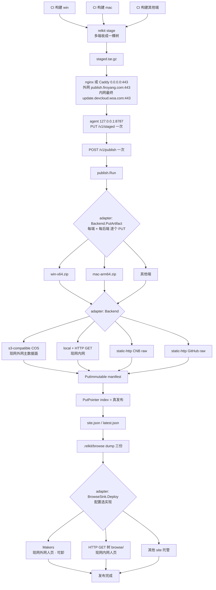
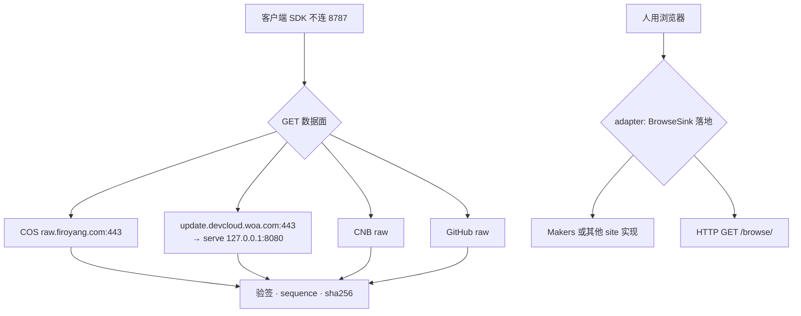

# 发布拓扑（2026-08-30）

---
title: 发布拓扑（控制面一条路，数据面 / 人页为 adapter）
category: design
created: 2026-08-30
updated: 2026-08-30
status: approved
related: docs/design/publish-agent.md, docs/design/update-ingress-cos.md, CLI.md, sites/updates-index/README.md
supersedes: 不取代既有文。`publish-agent.md` 与 `update-ingress-cos.md` 仍保留，之后再合并。
---

开发者审阅用的当前拓扑。旧文继续当历史与细节 SSOT；本文只画**流程与进程切面**。

## 1. 决议

- 控制面只有一个 **publish 节点**：nginx/Caddy（`:443` 切面）+ 本机 `relkit-agent`（`127.0.0.1:8787`）。反代是 HTTPS / 证书 / 入口日志的外壳，不是独立架构角色，也不是安全隔离层。
- CI 多端先 `relkit stage` 收成一棵树，对 agent **一次** `PUT /v1/staged`（整包 tar.gz），再 **一次** `POST /v1/publish`。逐个 PUT 发生在 `publish.Run` 对 Backend 写各端 artifact；**写 index 指针才是真发布**。
- 协议对象走 **Backend adapter**（COS / 磁盘+HTTP GET / CNB raw / GitHub raw）。人页走 **BrowseSink adapter**（Makers、HTTP 树上的 `browse/`、以及以后其它 site 托管）。不要用 `Backend.Type()` 猜测人页怎么部署。
- 环境差只在节点旁注明现网用法，不要为内外网发明第二种流程。

## 2. 进程与端口

| 进程 | listen | 切面 |
|---|---|---|
| nginx / Caddy | `0.0.0.0:443`（内网现网先 `:80`，有证再上 443） | 外网 `publish.firoyang.com:443`；内网最终 `update.devcloud.woa.com:443` |
| relkit-agent | `127.0.0.1:8787` | 不对外；`PUT /v1/staged` · `POST /v1/publish` |
| relkit-serve | `127.0.0.1:8080` | 仅「磁盘 + HTTP GET」这条，由同一 `:443` 转入 |
| COS / Makers / CNB / GitHub | 无本机进程 | 见 Backend / BrowseSink 节点 |

同机可以是一个 nginx、两个 `server_name`（CI 的 `/v1/*` → 8787，客户端 GET → 8080 或读盘）。内网 CI 打的是该箱**内网 IP:443** 上的名字，不是回环 hostname。

## 3. 发布

dump 三份：`index.html`（总目录）、`<product>.html`（单产品页）、`catalog.json`（合并用清单）。协议客户端不读。

## 4. 下载

## 5. BrowseSink 选型（实现约定）

`publish.Run` 打开 `[]Backend` 与 `[]BrowseSink`，人页只循环 sink。

- `Backend.HostsBrowse()==true`（`local`、`http-put`）→ `DataPlaneBrowse`：把 dump 三份 `PutPointer` 到 `browse/`。
- `site.makers` 已配，且本轮存在 `HostsBrowse()==false` 的 target → `MakersSink`。`--to local` 因此不会打 Makers。
- 本轮需要外部人页（有非 HostsBrowse 的后端）却没有配任何 site sink → 警告：协议可提交，人页不更新。
- 以后加 Cloudflare / GitHub Pages：新 sink 实现 + `relkit.json` 配置，不要再写 `Type()=="s3-compatible"`。

## 6. 现网落地（2026-08-30）

外网 CVM（`publish.firoyang.com:443` → `127.0.0.1:8787`）已按上表运行。内网同一切面，本机 origin 先 `:80`：

- nginx `0.0.0.0:80`：`/v1/` 与 `/-/health` → agent `127.0.0.1:8787`；其余 **GET/HEAD** → serve `127.0.0.1:8080`
- 客户端看到的 `https://update.devcloud.woa.com:443` 由 WOA 入口终止 TLS，再转到本机 `:80`。箱上暂无证书、不听 443；有证后再在本机加 `listen 443 ssl`，流程不变
- 配置样例：`deploy/nginx-intranet.example.conf`
- 人页 `browse/` 要等一次经 agent 的 `publish.Run`（`local` → `DataPlaneBrowse`）才会出现；此前 GET `/` 仍是 serve 自带目录页
