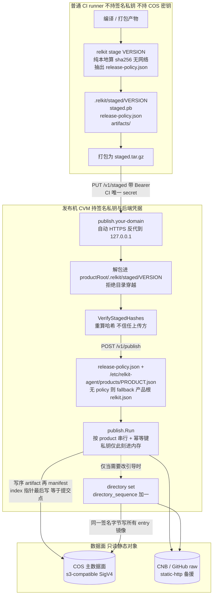
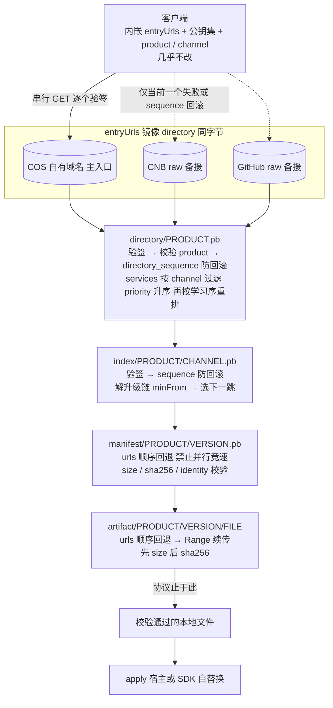

# 更新入口拓扑：自有域名 + COS（推荐方案）

---
title: 更新入口拓扑（COS 固定入口）
category: design
created: 2026-08-11
updated: 2026-09-01
status: approved
related: ADR 0005, docs/design/bootstrap-directory.md, docs/design/publish-topology.md, SPEC.md §1 / §3 / §13 / §16, CLI.md §6.5 / §6.6
---

## 1. 决议

**只记一套角色：CI 打包 → 控制面 agent 持钥写入 → 数据面只提供已经存在的文件 → 客户端匿名 GET。**

发布完成之后，树上每一项都已经是普通文件（或 COS 里的普通对象），URL 和路径一一对应。下载路径上不再查库、不现场拼给人看的索引、不验 Bearer（Bearer 只在控制面）。公网文件在 COS，内网文件在 WOA 磁盘上；看起来都是「按路径取文件」。

| 角色 | 公网（如 Dec） | 内网（如 SvnMergeTool） |
|---|---|---|
| CI | `relkit stage`，把 staged 树交给 agent | 同左 |
| 控制面 | `relkit-agent`（如 `publish.firoyang.com`） | 同一套 agent，写本机目录 |
| 数据面 | COS 桶前缀（如 `rup/`） | WOA 上一棵同样布局的目录 |
| 给人看的索引页 | 发布时写好的 HTML，托管在 **EdgeOne Makers**；**不**塞进 COS | 写入发布树 `browse/`，由 GET 原样返回（对齐前 serve 仍可现算一页） |

CVM / 发布机 **不是**客户端默认主入口。`relkit-serve` 是内网数据面的一种实现（Range GET；历史 PUT 为遗留），不是另一套发布协议。

`s3-compatible` 后端（SigV4 Put/Get）已实现，是公网写桶的前提；凭据只经环境变量传入。

## 2. 规范前提：什么「永远不要变」

协议已经约束客户端入口，并不是「所有链接都跟着客户端发版漂」：

| 层 | 谁持有 | 可否常改 |
|---|---|---|
| 内嵌 `entryUrls` + 公钥 + `product` / `channel` | 客户端常量 | **几乎不改**（发版才动） |
| 签名 `directory/<product>.pb` | `entryUrls` 指向的固定绝对 URL | 拓扑变更时覆盖写入 |
| 签名 `index` / `fallback` / `manifest` / `artifact` | directory 与文档内 `urls[]` | 随发布或迁移变更 |

因此「定下来就永远不要变」的，规范上是 **`entryUrls` 里那一条（组）绝对 URL**，通常为：

```text
https://updates.example.com/directory/<product>.pb
```

对象层（index / artifact 等）允许通过新 directory、新 index 的 `urls[]` 迁移，**禁止**为此改客户端常量。

客户端**禁止**自行拼接下载 URL（SPEC §1.1 / §12）；入口给的必须是绝对 URL。

## 3. 为何选 COS 自定义域名，而不是 CVM 绑域名

| 方案 | 做法 | 结论 |
|---|---|---|
| A. 域名 → CVM + HTTP（如 `relkit-serve`） | 部署简单 | 合法，但把全球延迟与可用性绑在单机/单地域；不作默认主入口 |
| B. 域名 → COS（可选 CDN） | 对象 key = URL 路径 | **推荐**：外表与「自建静态路径」同构，读路径可扩 CDN，写路径走对象 API |

腾讯云 COS 支持：

- **自定义源站域名** / **自定义 CDN 加速域名**（需备案域名 + DNS CNAME）
- 路径访问：例如 `https://updates.example.com/directory/myapp.pb` 对应桶内对象 key `directory/myapp.pb`（若配置了统一前缀，则 key = `prefix` + RUP key）
- 2024 年后新建桶对默认域名公网访问更受限；**自定义域名是正规对外方式**

推荐入口形态：

```text
https://updates.<your-domain>/directory/<product>.pb
https://updates.<your-domain>/index/<product>/<channel>.pb
https://updates.<your-domain>/manifest/...
https://updates.<your-domain>/artifact/...
```

`baseUrl` 配成 `https://updates.<your-domain>/`（或带产品前缀的子路径，末尾 `/`），与 SPEC §3 路径型后端一致。

## 4. 标准拓扑

发布与下载是两条独立链路，唯一交汇点是 **COS 上的静态对象**。发布侧没有任何常驻服务需要被客户端访问；客户端也永远不连发布机。

### 4.1 发布流程（构建 → 签名 → 写对象）



要点：

- **CI 不签名、不碰对象存储**，因此普通构建流水线不需要成为可信边界。stage 只把仓库侧 portable 策略打进 `release-policy.json`（无私钥、无后端凭据）。
- staged 目录跨机器可移植（`publish` 只读 `artifacts/<filename>`，不依赖 `staged.pb` 里的 `source_path`）。目录固定为 `staged.pb` + `release-policy.json` + `artifacts/`。
- 发布机用 **本机 publish profile**（`/etc/relkit-agent/products/<product>.json`）与 staged policy 合并；旧部署在缺少 policy 时仍可读产品根 `relkit.json`。
- `publish.Run` **不幂等**：同版本重发会让 `sequence` 继续 +1，所以发布入口必须自带幂等键与串行化。
- 发布机 **不必**出现在客户端 `entryUrls` 里；它只是控制面。

发布控制面是 `cmd/relkit-agent`（`PUT /v1/staged`、`POST /v1/publish`）。CI 只交 staged 包；私钥与 COS 密钥留在发布机，写在 profile / 环境变量里，不进 staged 树。内网也可以跑同一二进制，把 profile 的 `publishTo` 指到 `local`（写 WOA 磁盘）而不是 COS。

### 4.2 下载流程（引导 → 选路 → 校验）



要点：

- 客户端**禁止**自行拼接 URL：每一跳的地址都来自上一跳的签名文档（SPEC §1.1 / §12）。
- 镜像是「同一对象的多个取货点」，各镜像字节必须完全一致；区域差异只体现在 `urls[]` 顺序。
- 协议止于「校验通过的本地文件」；安装动作是宿主策略。

### 4.3 谁持有什么

- **CI**：源码、产物、agent token。没有私钥，没有 COS 密钥。staged 里只有 portable `release-policy.json`。
- **发布机**：签名私钥、COS 密钥、各备援后端凭据、`/etc/relkit-agent/products/<product>.json`。不对外提供下载。
- **COS（+ 备援）**：只有签名过的静态对象与匿名读权限。写权限只属于发布机。
- **客户端**：公钥、`entryUrls`、`product` / `channel`。只读，不持任何凭据。

### 4.4 边界表（进不了 COS / 能进 COS）

| 概念 | 能否「进 COS」 | 说明 |
|---|---|---|
| 匿名 GET 的 directory / index / fallback / manifest / artifact **文档与文件** | **能** | 它们是静态对象，不是常驻微服务 |
| Bearer token 式「上传服务」（`relkit-serve` PUT） | **不能** | COS 不是该语义；上传由发布机经 `s3-compatible` 调对象 API |
| 签名动作 / 私钥 | **不能放在 COS 或公网机当常驻密钥** | 私钥只在发布控制面短暂使用 |
| `relkit-serve` 孤儿 GC、按前缀发 Cache-Control | **不是 COS 内置等价物** | 缓存靠 COS/CDN 控制台按前缀配置；GC 另议或靠 `retainVersions` + 运维 |

常见误解：把 index / directory 说成「进不了 COS 的服务」。协议里它们是**签名过的可变指针文档**，恰恰适合对象存储 + 短缓存。

### 4.5 控制面永远是 agent，serve 只是内网数据面的一种实现

不要把「内网有一台 HTTP」记成另一套发布协议。角色已经一样，只是内网曾经把两台机器的工作塞进一个二进制：

- **控制面永远是 `relkit-agent`**：持私钥、串行 publish、写入数据面。客户端永远不连它。公网写 COS（`s3-compatible`）；内网写本地目录（`local`，或 agent 写盘、前面再挂 nginx / serve GET）。
- **数据面只是文件**：匿名 GET 返回已写入的字节。公网 = COS；内网 = WOA 磁盘。COS、nginx 裸目录、CDN 都能干这件事。
- **`relkit-serve`** = 内网数据面的一种实现：正确的 Range GET、按前缀分流缓存、可选孤儿 GC。鉴权 PUT 是迁到 agent 之前的遗留写入面，不是新产品该走的发布控制面。它不认识 COS，也不会把 PUT 转发到对象存储。
- **给人看的索引页也是文件**（发布时写好）。协议客户端不读它。公网 HTML 走 EdgeOne Makers，COS 只留协议对象；内网写在 `browse/`。打开更新域名应看到产品/版本/下载，而不是把 `.pb` 当导航。

`baseUrl`（客户端下载）与控制面域名分开：`publish.*` 只给 CI，`updates.*` / `raw.*` / 内网更新域名只给 GET。

## 5. 缓存硬约束

与 SPEC §3.1 / `relkit-serve` 前缀语义对齐，**在 COS / CDN 控制台按前缀配置**：

| 前缀 | 可变性 | 缓存 |
|---|---|---|
| `directory/` | 可变指针 | 短缓存（≤ 60s）或 no-cache |
| `index/` | 可变指针 | 同上 |
| `fallback/` | 可变指针 | 同上 |
| `manifest/` | 不可变 | 长缓存（可至 1 年） |
| `artifact/` | 不可变 | 长缓存（可至 1 年） |

客户端读 directory / index / fallback 时应带缓存击穿参数或 `Cache-Control: no-cache`（SPEC §3.1 / §12）。  
配置错误的典型现场：**发布成功但客户端几分钟内看不到更新**——先查 CDN/COS 是否把可变前缀缓存长了。

## 6. 客户端内嵌合约（与 ADR 0005 一致）

长期内嵌：

- `entryUrls`：有序，主 → 备；**主 URL 指向自有域名上的 directory 对象**
- 建议备援仍为 CNB raw、GitHub raw 上**同一字节**的 directory 副本（主不可达才试）
- 公钥集、`product`、`channel`

不要内嵌会随机房迁移而变的单一 `indexUrl` 作为唯一入口（兼容旧宿主除外，见 SPEC §16.4）。

## 7. 后端选型对照（发布侧）

| 目标 | 后端 type | 状态 / 备注 |
|---|---|---|
| COS 自定义域名整树托管，CLI 直接写桶 | `s3-compatible` | **已实现**；字段见 CLI.md（`endpoint` / `bucket` / `prefix` / `baseUrl` / `accessKeyEnv` / `secretKeyEnv`，可选 `region` / `forcePathStyle` / `timeoutSeconds`） |
| CNB / GitHub 仓库直链托管 directory 或整树 | `static-http` + `stageDir` | **已实现** |
| 自建磁盘上的发布树（内网 agent 写盘，或离线演练） | `local` | **已实现**；内网主路径 |
| 遗留：经 serve 鉴权 PUT | `http-put` | **已实现**；新产品改走 agent；旧产品可暂留直到迁完 |

正式发布优先配置 `s3-compatible`。**禁止**手工打乱「产物 → manifest → 指针最后写」顺序冒充正式发布（见 AGENT-GUIDE）。

## 8. 迁移 runbook：COS ↔ CNB（或其它路径型镜像）

适用：项目先整树（或主流量）在 COS，后希望主流量或整树迁到 CNB 仓库直链（`static-http`）；反向同理。  
原则来自 SPEC §1.1 / §5.3 与 bootstrap-directory：客户端不改常量；靠双写 + 改 directory / `urls[]`。

### 8.1 阶段 A — 双写，不关旧源

1. 增加目标后端（例：CNB `static-http`，`baseUrl` 为可匿名 GET 的 `/-/raw/...` 前缀，`stageDir` 指向仓库内发布树）。  
2. `publishTo` 同时包含 `cos` 与 `cnb`（名称随意）。  
3. 再发至少一版：同一 artifact / manifest / index 字节落到两边；新文档 `urls[]` 含两侧取货点。  
4. `relkit verify`（必要时 `--deep`）两侧都通过。

### 8.2 阶段 B — 改引导，仍保留旧源 URL

1. `relkit directory set`（或等价）升高 `directorySequence`，把 `services[].indexUrl` **优先**（或仅）指到新源上的 index。  
2. 将**同一签名 directory 字节**写到所有 `entryUrls` 镜像（自有域名 COS + CNB + GitHub 等）。  
3. **不发客户端**；观察真实更新是否稳定走新源。

### 8.3 阶段 C — 新发布停止写旧源

1. `publishTo` 去掉旧后端。  
2. 新节点的 `urls[]` 可以只含新源。  
3. 旧桶 / 旧路径上的对象**先保留**。

### 8.4 阶段 D — 退役旧源

仅当「当前 index 仍引用、且升级链仍可能下载到的对象」在新源均有可访问副本后，再清空或关闭旧源。

### 8.5 陷阱：旧 manifest 只有单镜像 URL

manifest / artifact **发布后不可变**。若某历史版本的 manifest 当年只写了 COS URL，直接关桶会弄断仍依赖该跳的 `minFrom` 链。

处置：

- 过渡期继续保留旧源对象；或  
- 做运维级「同版本、同产物字节、新 manifest（多镜像 URL）」并升 index `sequence`（若工具尚无现成命令，须按协议手工保证哈希与签名一致，不得改旧对象冒充）。

`retainVersions` 较小（整包产品）时，待引用集合缩小后退役更简单。

### 8.6 directory 入口本身也曾只在单源

若 `entryUrls` 主入口只绑在即将退役的宿主上，关源前必须已有备援 entry 且其上 directory 字节最新；否则会连引导一起丢。这正是 ADR 0005「一主两备」的原因。推荐主 URL 始终落在**自有域名 COS**，备援落 CNB / GitHub，即使整树 artifact 已迁走，directory 小文件仍建议留在主域名上（或主域名继续托管整树）。

## 9. 文档与实现边界

| 已冻结（本文 + ADR 0005） | 后续可选 |
|---|---|
| 固定入口 = 自有域名 + COS | CDN 加速域名 + 证书托管自动化 |
| CVM = 发布控制面，非默认客户端入口 | 历史版本「补镜像 URL」专用命令（若需要） |
| directory/index 等**文档**可进 COS | |
| `s3-compatible` 发布侧写桶 | |

## 10. 实装清单（firoyang.com / 广州）

本仓库对外演练 / 自用入口（2026-08-11 起）：

| 项 | 值 |
|---|---|
| 协议对象域名（迁完后） | `raw.firoyang.com`（与 `updates` **双挂同一 COS 桶**，直到旧客户端升完） |
| 给人看的索引域名（迁完后） | `updates.firoyang.com` → EdgeOne Makers；迁域前仍指向 COS |
| 更新域名（现网 / 旧客户端 `entryUrls`） | `updates.firoyang.com` |
| DNS | `updates` CNAME → `relkit-updates-1251882798.cos.ap-guangzhou.myqcloud.com`（DNSPod，TTL 600）；`raw` 应 CNAME 到同一 COS 主机 |
| COS 桶 | `relkit-updates-1251882798` |
| 地域 | `ap-guangzhou` |
| AppId | `1251882798` |
| 对象前缀 | `rup/`（RUP key 仍为 `directory/...` 等；完整对象路径 = `rup/` + key） |
| 默认桶域名（已验证 HTTPS 匿名 GET） | `https://relkit-updates-1251882798.cos.ap-guangzhou.myqcloud.com/` |
| 发布控制面 CVM | `ins-78r3y0si`，公网 `43.138.156.146`，可用区 `ap-guangzhou-6`（**不**写入客户端 `entryUrls`） |
| 发布机域名 | `publish.firoyang.com` A → `43.138.156.146`（agent + Caddy；见 [`publish-agent.md`](publish-agent.md)） |
| 桶策略 | 匿名 `GetObject` / `HeadObject` / `OptionsObject`（仅读；写仍需密钥） |
| HTTPS 证书 | TrustAsia C1 DV Free，证书 ID `ZwMfmDwc`，有效期至 **2026-11-10**（三个月，需按期续期） |

`relkit.json` 仓库侧仍描述产品策略；真正写桶的字段（`s3-compatible` 等）落在发布机 profile。后端样例（profile 的 `backends` 条目，旧 fallback 也可写在产品根 `relkit.json`）：

```json
{
  "type": "s3-compatible",
  "endpoint": "https://cos.ap-guangzhou.myqcloud.com",
  "bucket": "relkit-updates-1251882798",
  "region": "ap-guangzhou",
  "prefix": "rup/",
  "baseUrl": "https://raw.firoyang.com/rup/",
  "accessKeyEnv": "COS_SECRET_ID",
  "secretKeyEnv": "COS_SECRET_KEY"
}
```

客户端内嵌主入口：已装上的版本写死了 `updates.`，**不会自己改这串字**。新 directory / 新客户端改 `raw.`；旧客户端升完后再把 `updates.` 让给索引站。

```text
https://raw.firoyang.com/rup/directory/<product>.pb
```

（现网旧客户端仍是 `https://updates.firoyang.com/rup/directory/<product>.pb`，双挂期间两边必须能 GET 到同一对象。）

**不要**为了赶时间先用默认桶域名发一版：`entryUrls` 一旦随二进制发出去就几乎不可变，那样等于把厂商、地域、桶名焊进所有老客户端，之后只能按 §8 双写迁移收场。

给人看的索引页没有编译进客户端，换托管或换域名只影响书签，**不影响**已装客户端的更新链。COS 只放协议对象：根路径 `GET /` 403 是 REST 源站拒 ListBucket，不要为此打开「静态网站源站」。公网索引站是 EdgeOne Makers（契约目录 `sites/updates-index/`，当前纯静态、无 `edge-functions/`）；`relkit publish` 在公网 COS 目标上若配了 `site.makers`，会把产品 `.relkit/browse/` dump 直接 Upload。内网用同一份 dump 写在数据面 `browse/`，不经过 Makers。

### 10.1 证书（已完成，含续期义务）

`updates.firoyang.com` 的 HTTPS 走腾讯云 SSL 免费证书，全流程可 API 化，无需控制台：

1. `ApplyCertificate`：`DvAuthMethod: "DNS_AUTO"`、`DomainName`、**`PackageType: "83"`**（TrustAsia C1 DV Free）。`PackageType: "2"` 会报 `FailedOperation.CertificateInvalid`。
2. 轮询 `DescribeCertificateDetail`：`Status` 走 `4`（已加 DNS 验证记录）→ `1`（已签发）。域名托管在同账号 DNSPod 时，验证 TXT 由平台自动写入，约两分钟签发。
3. `DescribeHostCosInstanceList`：只传 `CertificateId` 即可列出可部署的 COS 实例（返回 domain / bucket / region）。传 `Region` 会报 `UnknownParameter`。
4. `DeployCertificateInstance`：`ResourceType: "cos"`，`InstanceIdList` 元素格式必须是 **`Region|Bucket|Domain`**（写成 `Bucket|Region|Domain` 会报 `CertificateNotDeployInstance`，容易误判成证书与域名不匹配）。
5. 用 `DescribeHostDeployRecordDetail` 确认 `Status: 1`；边缘下发另需一段时间，期间仍会握手到 COS 默认通配证书。

免费证书**只有三个月有效期**（本次至 2026-11-10），到期前必须重新申请并重新部署。上面五步适合直接做成脚本或定时任务；这也是后续若接 CDN、把证书托管交给 CDN 管理的动机之一。

### 10.2 剩余待办

1. 按 §5 为 `directory/` / `index/` / `fallback/` 设短缓存，`manifest/` / `artifact/` 设长缓存。
2. 证书续期自动化（见 §10.1）。
3. 需要边缘加速时再挂 CDN 加速域名（届时 CNAME 改指 `*.cdn.dnsv1.com`，证书托管随之迁到 CDN）。
4. ~~COS 控制台为 `raw.firoyang.com` 绑定自定义源站域名并部署证书~~ **已完成（2026-08-27）**：`raw` CNAME 已指向同一 COS 主机；桶自定义源站域名为 REST；证书 `aKgyuExf` 已签发并 `DeployCertificateInstance` 到 `ap-guangzhou|relkit-updates-1251882798|raw.firoyang.com`。匿名 `GET https://raw.firoyang.com/rup/directory/dec.pb` 返回 200。**不要动 `updates.`。**
5. 公网：仓库 `relkit.json` 的 `site.makers` 随 stage 进入 `release-policy.json`，本机 profile 提供 `tokenEnv`；`relkit publish` 会把 `.relkit/browse/` 部署到 Makers（项目 `relkit-updates-index`）。内网 publish 已写 `browse/`，不必再部署 Makers。

凭据：`COS_SECRET_ID` / `COS_SECRET_KEY` 只进发布机环境（或 mise 私密配置），**禁止**写入仓库。

### 10.3 域名切：`raw.` 双挂 COS，再把 `updates.` 让给索引站

`entryUrls` 改不起；索引站域名改得起。顺序：

1. **DNS**：`raw` CNAME 到与 `updates` 相同的 COS 主机（`relkit-updates-1251882798.cos.ap-guangzhou.myqcloud.com`）。**已完成。**
2. **COS 自定义源站域名**绑定 `raw.firoyang.com`，并部署 HTTPS 证书（与 `updates` 同一套续期流程，§10.1）。**已完成**；匿名 GET 已通。
3. 新发版 `baseUrl` / 新客户端 `entryUrls` 走 `https://raw.firoyang.com/rup/...`。
4. 公网 publish（配了 `site.makers`）把 dump 部署到 Makers。内网跳过这步。**不要**把 HTML 拷进 relkit 仓库的 `sites/updates-index/` 当发版步骤。
5. 旧客户端都升到认 `raw.` 之后，再把 `updates` CNAME 改到 EdgeOne Makers。在此之前不要动 `updates`，否则已装 Dec 会找不到 directory。

## 11. 交叉引用

- 协议：[`SPEC.md`](../../SPEC.md) §1.1、§3、§5.3、§13、§16
- Directory 设计：[`bootstrap-directory.md`](bootstrap-directory.md)
- 决策记录：[`../adr/0005-signed-bootstrap-directory.md`](../adr/0005-signed-bootstrap-directory.md)
- 工具接口与后端表：[`CLI.md`](../../CLI.md) §6
- 操作手册：[`embed/AGENT-GUIDE.md`](../../embed/AGENT-GUIDE.md)
- 给人看的索引站：[`sites/updates-index/README.md`](../../sites/updates-index/README.md)
- 实装参数：本文 §10
- 发布 agent（含内网）：[`publish-agent.md`](publish-agent.md)
